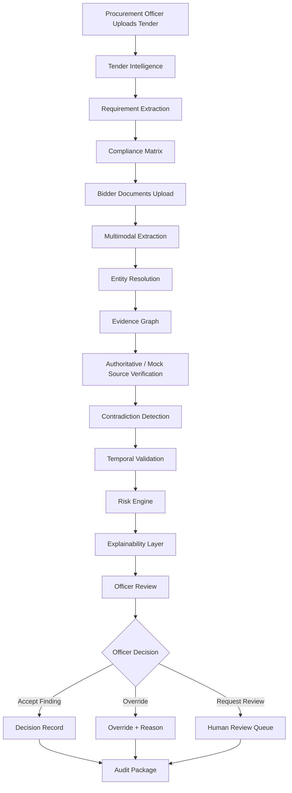
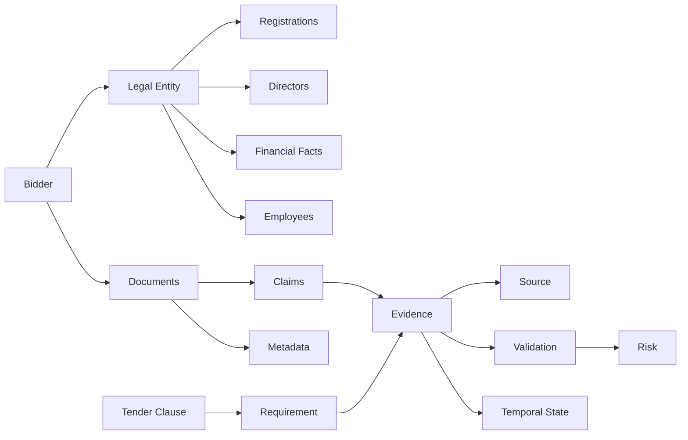
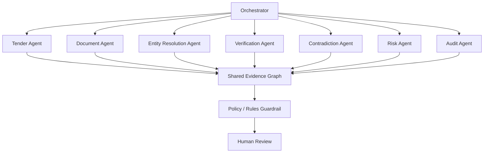
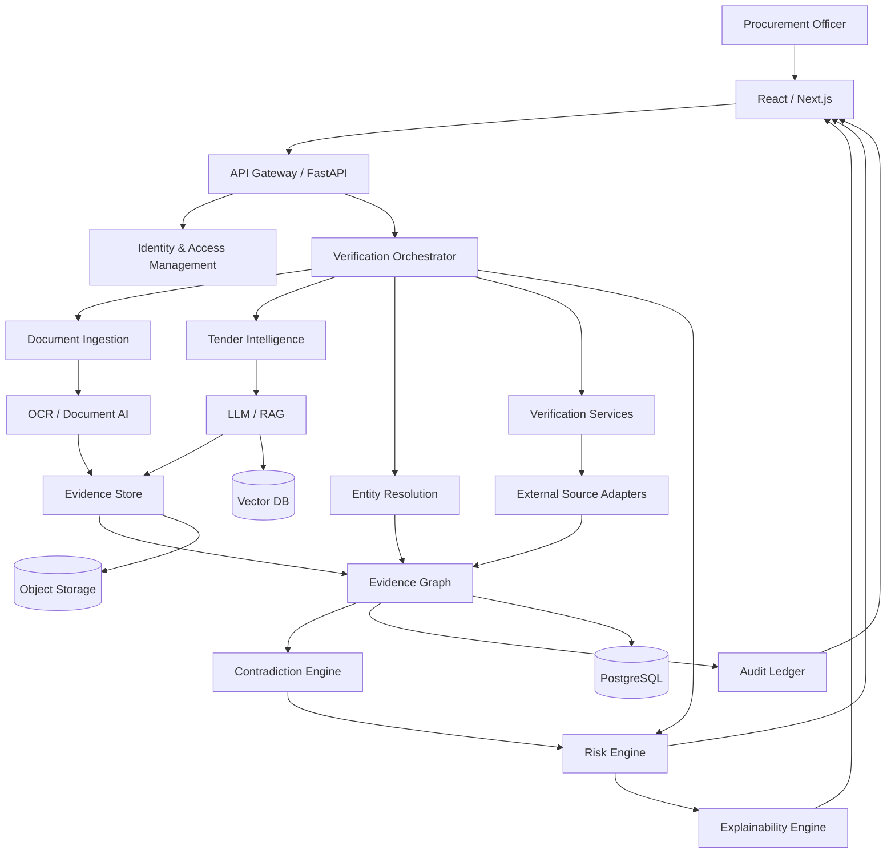
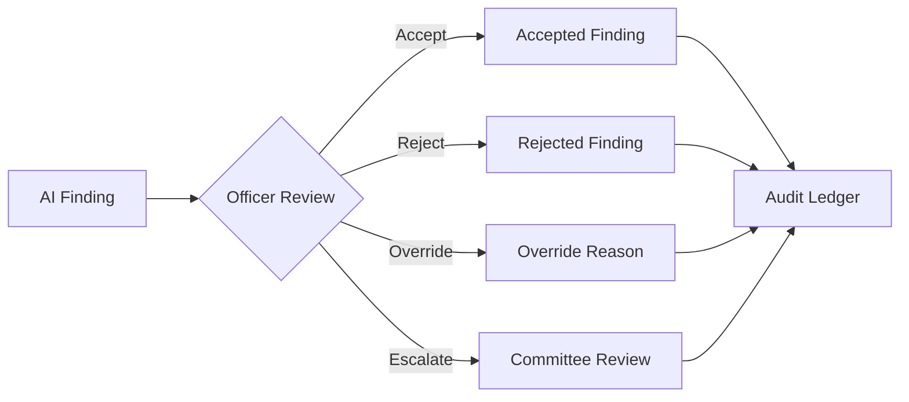

# Product Requirements Document (PRD)

# **VERITAS-GEM**

### **Evidence-Backed AI Compliance Co-Pilot for Government Procurement**

> **One-line positioning:**
> **VERITAS-GEM turns every tender and bidder into an evidence-backed, time-aware compliance graph—so procurement officers review exceptions instead of manually reviewing documents.**

**Problem Statement:** SIH26100
**Title:** AI-Powered Integrated Bid Compliance Verification Platform for GeM Procurement
**Category:** Software — Smart Automation
**Primary stakeholder:** Government procurement organizations / GeM ecosystem
**Product type:** AI-assisted procurement decision-support platform
**Decision authority:** Procurement Officer / Tender Evaluation Committee
**AI principle:** **AI interprets and prioritizes; authoritative sources and deterministic rules validate; humans decide.**

The SIH problem list identifies SIH26100 as the Ministry of Petroleum & Natural Gas problem statement for an AI-powered integrated GeM bid-compliance verification platform.  The supplied design brief explicitly calls for an explainable, secure, human-in-the-loop platform spanning tender interpretation, multimodal verification, evidence graphs, contradiction detection, temporal compliance and controlled agentic orchestration. 

---

# 1. Executive Summary

Government procurement is digitally mediated, but **verification remains evidence-fragmented**.

A procurement officer may need to determine whether a bidder satisfies:

* tender-specific eligibility
* statutory registrations
* tax-related requirements
* financial requirements
* MSME/startup conditions
* certifications
* OEM authorization
* local-content requirements
* blacklisting/debarment conditions
* other documentary and source-verification requirements

The fundamental problem is not merely document volume. It is that **a single compliance conclusion can depend on multiple documents, multiple sources, multiple dates and multiple interpretations of a tender clause**.

The proposed platform, **VERITAS-GEM**, creates a digital evidence layer between raw procurement information and the human decision-maker.

Its core model is:

```text
Tender
   ↓
Tender Intelligence
   ↓
Requirement Graph
   ↓
Bidder Evidence Graph
   ↓
Authoritative / Mock Source Validation
   ↓
Cross-Document Consistency Analysis
   ↓
Temporal Compliance
   ↓
Risk Prioritization
   ↓
Explainable Findings
   ↓
Procurement Officer Review
   ↓
Human Decision
   ↓
Immutable Evidence Package
```

The product is deliberately **not** a generic document chatbot. It is a **verification system** in which every material AI finding must be linked to evidence, source, validation method and confidence. This follows the uploaded brief's explicit requirement for evidence-backed conclusions and human approval. 

The product's principal innovation is the **Bidder Digital Twin / Evidence Graph**: a structured representation linking the legal entity, registrations, documents, tender clauses, evidence, source records, temporal states, contradictions and risk signals. 

---

# 2. Problem Definition

## 2.1 Core problem

A conventional compliance workflow answers:

> "Do I have all the documents?"

VERITAS-GEM must answer a more difficult question:

> **"Does this bidder satisfy every applicable requirement, based on consistent, traceable, sufficiently authoritative evidence, as of the relevant procurement date?"**

That distinction is fundamental.

A bidder can have:

* a document that exists but is expired
* a certificate that is valid but belongs to another entity
* a registration whose number is correct but whose name differs
* a turnover value in one document that conflicts with another
* a tender requirement that applies conditionally
* a document that appears compliant but does not actually prove the clause
* a government-source record inconsistent with bidder-submitted evidence

Therefore, compliance is a **relationship + evidence + time + rule** problem.

## 2.2 Systemic problem

The system must overcome five fragmentation dimensions:

| Fragmentation          | Example                                                |
| ---------------------- | ------------------------------------------------------ |
| Document fragmentation | certificates, financials, declarations, authorizations |
| Source fragmentation   | bidder evidence + authoritative records                |
| Semantic fragmentation | same fact expressed differently                        |
| Temporal fragmentation | validity differs by date                               |
| Decision fragmentation | different evaluators inspect different evidence        |

---

# 3. Current-State Pain Points

The supplied PRD brief describes manual examination and cross-verification across registrations, tax information, company information, local-content claims, employee-related records, authorizations, digital documents and tender-specific evidence. 

### 3.1 Manual effort

Officers repeatedly:

1. read tender clauses
2. identify applicable requirements
3. locate bidder evidence
4. inspect documents
5. cross-check identity
6. validate dates
7. compare values
8. investigate contradictions
9. document conclusions
10. prepare evaluation evidence

### 3.2 Checklist limitation

A static checklist cannot reason over:

> "If condition X applies, then Y must be established using evidence Z."

### 3.3 Document-only limitation

OCR tells us what a document says.

It does not tell us:

> whether the statement is consistent with another source.

### 3.4 LLM-only limitation

A language model can interpret wording, but should not be the final arbiter of statutory/tender compliance.

### 3.5 Point-in-time limitation

"Currently valid" and "valid on bid submission date" are different propositions.

The uploaded brief explicitly identifies temporal verification as a differentiator. 

---

# 4. Target Users & Personas

| Persona                      | Main objective                        | Pain                            |
| ---------------------------- | ------------------------------------- | ------------------------------- |
| Procurement Officer          | Verify bidder eligibility efficiently | High manual verification effort |
| Tender Evaluation Committee  | Reach defensible collective decision  | Fragmented evidence             |
| Compliance/Audit Officer     | Reconstruct why decision was made     | Poor evidence lineage           |
| Department Administrator     | Configure workflows and policies      | Rule maintenance complexity     |
| Technical evaluator          | Validate technical clauses            | Excessive document scanning     |
| Senior procurement authority | Monitor risk and throughput           | No portfolio-level intelligence |

The target-user set corresponds to the uploaded brief. 

---

# 5. Jobs To Be Done

## Procurement Officer

> When I receive multiple bids, I need the system to identify what actually requires my attention and show the evidence behind each finding, so I can make a defensible decision quickly.

## Evaluation Committee

> When reviewing a bidder, I need a consistent evidence package so different evaluators operate from the same factual record.

## Auditor

> When questioning a procurement decision, I need to reconstruct exactly what evidence was available, what the system concluded, and what the officer decided.

## Administrator

> When rules or policies change, I need to update the deterministic validation layer without retraining the entire AI system.

---

# 6. Product Vision

## Vision

**Build the evidence intelligence layer for trustworthy digital procurement.**

VERITAS-GEM should become the system that converts heterogeneous procurement information into:

> **structured requirements + validated evidence + temporal state + explainable risk + human decision support**

It is not intended to replace procurement officers.

It is intended to make their attention more valuable.

---

# 7. Product Mission

Reduce the cognitive and administrative burden of bid verification while increasing:

* consistency
* traceability
* review prioritization
* auditability
* evidence quality
* processing speed
* procurement transparency

The uploaded specification explicitly prioritizes accuracy, explainability, auditability, security, interoperability, scalability, transparency, lower verification effort and faster tender evaluation. 

---

# 8. Proposed Solution

VERITAS-GEM has eight cooperating layers.

### Layer 1 — Tender Intelligence

Converts a tender document into a structured requirement graph.

### Layer 2 — Multimodal Evidence Extraction

Converts bidder documents into structured claims and evidence.

### Layer 3 — Entity Resolution

Determines whether references across documents represent the same legal entity.

### Layer 4 — Authoritative Validation

Compares extracted claims against approved sources or controlled mock integrations.

### Layer 5 — Evidence Graph

Connects clauses, claims, documents, sources, entities and validation events.

### Layer 6 — Contradiction & Anomaly Engine

Detects semantic and numerical inconsistencies.

### Layer 7 — Risk & Explainability Engine

Prioritizes findings based on evidence strength, contradiction severity and requirement criticality.

### Layer 8 — Human Decision Workspace

Lets the officer inspect evidence, accept/reject findings, override AI conclusions and create the final decision package.

---

# 9. Unique Value Proposition

## Conventional system

> "Here are 70 uploaded PDFs."

## VERITAS-GEM

> "Here are the 8 requirements that need your attention, the evidence supporting each, the conflicts detected, the authoritative checks performed, the state as of the bid date, and the exact pages/source records from which the conclusions were derived."

### Core proposition

**Less document searching. More evidence-based decision making.**

---

# 10. Innovation & Differentiation

The uploaded brief defines several required differentiators. 

## 10.1 Bidder Digital Twin

A bidder is represented as a structured entity:

```text
Bidder
 ├── Legal Entity
 ├── Registrations
 ├── Directors
 ├── Documents
 ├── Certifications
 ├── Financial Facts
 ├── Government Source Records
 ├── Products
 ├── OEM Relationships
 ├── Tender Participation
 ├── Historical Findings
 └── Risk Signals
```

This enables reasoning across documents instead of treating documents independently.

## 10.2 Tender-Aware Compliance

Instead of:

> "Does every bidder have GST?"

the system asks:

> "Does this particular tender require this bidder to satisfy this particular condition, and what evidence demonstrates that?"

## 10.3 Evidence Lineage

Every finding has:

```text
Finding
→ Evidence
→ Source
→ Timestamp
→ Validation method
→ Confidence
→ Human action
```

## 10.4 Compliance Time Machine

The system can reconstruct:

> **"What was the compliance state on the bid submission date?"**

## 10.5 Contradiction Radar

Instead of simply searching for missing documents, the system searches for **inconsistency**.

## 10.6 Risk-Based Review

The officer should not spend equal attention on every bidder and every clause.

The system prioritizes review:

```text
LOW
Evidence strong, no contradictions
        ↓
MEDIUM
Some uncertainty / indirect evidence
        ↓
HIGH
Conflicting or weak evidence
        ↓
CRITICAL
Potential material misrepresentation / mandatory issue
```

---

# 11. End-to-End User Journey



---

# 12. Detailed User Stories

### Tender intelligence

**US-01**
As a Procurement Officer, I want the system to extract tender-specific eligibility requirements so that I do not have to manually construct the checklist.

**US-02**
I want each extracted requirement linked to its source clause.

### Evidence

**US-03**
As an evaluator, I want bidder documents automatically converted into structured evidence.

**US-04**
I want every extracted field linked to a page, bounding region or source.

### Contradiction analysis

**US-05**
I want the system to highlight contradictions across documents.

### Temporal verification

**US-06**
I want to know whether a certificate or registration was valid on the relevant date.

### Explainability

**US-07**
I want to click "Why?" and see precisely why the system generated a finding.

### Human control

**US-08**
I want to accept, reject or override system findings.

### Audit

**US-09**
I want a reproducible record of evidence and decisions.

---

# 13. Functional Requirements

## 13.1 Tender ingestion

**Must Have**

* PDF upload
* document classification
* section extraction
* clause segmentation
* OCR for scans
* requirement extraction
* clause-source linkage

## 13.2 Bidder ingestion

* multi-file upload
* automatic document classification
* OCR
* table extraction
* metadata extraction
* duplicate detection

## 13.3 Requirement engine

Each requirement must contain:

```json
{
  "requirement_id": "REQ-001",
  "clause": "4.2.3",
  "requirement": "Minimum annual turnover",
  "threshold": 10000000,
  "unit": "INR",
  "applicability": "mandatory",
  "required_evidence": ["financial_statement"],
  "validation_mode": ["document", "source"],
  "criticality": "high"
}
```

## 13.4 Evidence object

```json
{
  "evidence_id": "EV-0234",
  "claim": "Annual turnover = INR 12 crore",
  "document_id": "DOC-009",
  "page": 17,
  "source": "Audited Financial Statement",
  "extraction_confidence": 0.97,
  "verification_status": "requires_review"
}
```

---

# 14. AI/ML Capabilities

The AI layer should perform interpretation and prioritization, not unbounded legal decision-making.

## Core AI tasks

| Task                    | Model                                  |
| ----------------------- | -------------------------------------- |
| Clause classification   | Transformer/LLM                        |
| Requirement extraction  | LLM + schema-constrained extraction    |
| Semantic matching       | Embeddings                             |
| Entity resolution       | Embeddings + deterministic identifiers |
| Document classification | Vision/document model                  |
| Table extraction        | Layout-aware model                     |
| Contradiction detection | Rules + semantic comparison            |
| Anomaly scoring         | Statistical/ML                         |
| Explanation             | Grounded generation                    |
| Risk prioritization     | Hybrid ML/rules                        |

---

# 15. Compliance Intelligence Engine

The central compliance model is:

```text
Requirement
      +
Applicability
      +
Evidence
      +
Source Verification
      +
Temporal State
      +
Rule Evaluation
      ↓
Compliance State
```

### Compliance states

* Verified
* Highly probable
* Requires human review
* Conflicting evidence
* Unable to verify
* Non-compliant

These states are explicitly required by the supplied design brief. 

---

# 16. Tender Intelligence Engine

## Objective

Convert natural-language tender clauses into machine-evaluable requirements.

### Input

Tender PDF.

### Processing

1. structure recognition
2. clause segmentation
3. semantic classification
4. requirement extraction
5. dependency analysis
6. applicability detection
7. evidence-type mapping
8. validation-method assignment

### Output

**Tender Compliance Matrix**

| Clause | Requirement             | Evidence          | Validation              | Criticality |
| ------ | ----------------------- | ----------------- | ----------------------- | ----------- |
| 4.1    | Valid GST registration  | GST record        | Source + document       | High        |
| 4.2    | Minimum turnover        | Audited statement | Numeric validation      | High        |
| 4.3    | OEM authorization       | Letter            | Document + entity match | Medium      |
| 4.4    | Local-content threshold | Declaration       | Rule + evidence         | High        |

The uploaded brief explicitly proposes this requirement-to-evidence chain. 

---

# 17. Evidence Graph / Bidder Digital Twin



### Graph relationships

* `SUBMITTED_BY`
* `REFERS_TO`
* `PROVES`
* `VERIFIED_AGAINST`
* `CONTRADICTS`
* `VALID_DURING`
* `REQUIRED_BY`
* `SATISFIES`
* `RELATED_TO`

---

# 18. Multi-Agent Verification Architecture

The uploaded brief proposes specialized agents including Tender Understanding, Document Intelligence, Registration Verification, Tax Compliance, Entity Resolution, Cross-Verification, Fraud/Anomaly Detection, Rules, Evidence/Audit and Recommendation agents. 

## Recommended architecture

Agents should be **task-specialized but policy-constrained**.



## Agent restrictions

Agents cannot:

* approve bidders
* disqualify bidders
* modify authoritative records
* invent evidence
* suppress contradictory evidence
* bypass access control

Agents can:

* extract
* classify
* compare
* prioritize
* recommend
* request additional evidence

---

# 19. Document Intelligence Pipeline

```text
Upload
 ↓
Virus / file validation
 ↓
Document classification
 ↓
OCR / native text extraction
 ↓
Layout detection
 ↓
Table extraction
 ↓
Entity extraction
 ↓
Claim extraction
 ↓
Evidence linking
 ↓
Confidence estimation
```

### Supported MVP formats

* PDF
* image
* scanned PDF

### Advanced

* QR codes
* signatures
* stamps
* metadata
* complex tables

The supplied brief explicitly requires support for PDFs, scanned documents, images, certificates, tables, stamps, signatures, QR codes, metadata and structured source responses. 

---

# 20. Contradiction & Anomaly Detection

## Contradiction categories

### Identity

* company legal name mismatch
* PAN/GST mismatch
* address inconsistency

### Temporal

* certificate expired
* issuance date after claimed eligibility date
* registration status mismatch

### Financial

* turnover inconsistencies
* employee count discrepancies
* financial statement conflicts

### Authorization

* OEM mismatch
* authorization validity mismatch

### Content

* local-content claim differs across documents
* specifications differ between technical and commercial submissions

### Source contradiction

```text
Bidder document:
Turnover = ₹12 Cr

Authoritative/mock record:
Turnover = ₹8 Cr

→ MATERIAL CONTRADICTION
```

The contradiction categories above directly reflect the uploaded brief. 

---

# 21. Risk & Compliance Scoring

A single opaque score must not be used.

The uploaded design specifically rejects a mysterious "87% compliant" score and instead requires decomposable dimensions. 

## Proposed scorecard

```text
Compliance Confidence
├── Mandatory Requirement Coverage
├── Evidence Strength
├── Source Verification
├── Identity Consistency
├── Temporal Validity
├── Financial Consistency
├── Tender Eligibility
└── Contradiction Risk
```

### Example

| Dimension              | Result |
| ---------------------- | -----: |
| Mandatory requirements |   100% |
| Evidence strength      |    91% |
| Source verification    |    84% |
| Identity consistency   |   100% |
| Temporal validity      |    96% |
| Contradiction risk     | Medium |

The system should display **why** each value exists.

---

# 22. Explainable AI

## "Show Me Evidence"

Every material finding opens an evidence drawer.

### Example

> **GST Compliance — AT RISK**

**What was checked**
GST registration status.

**Evidence used**
Bidder registration certificate.

**External verification**
Mocked authorized-source adapter for demo.

**Conflict**
Legal name differs by one material token.

**Confidence**
0.89

**Validation method**
Deterministic identity matching + semantic similarity.

**Recommended action**
Manual verification.

The uploaded brief explicitly defines this "Why?/Show Me Evidence" interaction. 

---

# 23. Temporal Compliance Verification

## Core capability

The system should model facts as temporal events:

```text
Certificate
Issued: 02-01-2025
Valid Until: 01-01-2027

Bid Submission:
15-09-2026

Result:
VALID ON BID DATE
```

### Temporal checks

* issued before bid
* active on bid date
* not expired
* not suspended
* applicable filing period satisfied
* tender timeline satisfied

### UX

A slider:

```text
2025 ─────── 2026 ─────── 2027
               ▲
         Bid submission
```

Clicking a date reconstructs the known evidence state.

---

# 24. Government Integration Strategy

This is a major credibility point.

The system must **not** claim direct access to government systems unless the integration is actually authorized and technically available.

The uploaded brief explicitly instructs the prototype to classify integrations as real, mocked, simulated or manual and to avoid assuming public APIs. 

## Integration matrix

| Source                   | MVP mode                  | Production mode                      |
| ------------------------ | ------------------------- | ------------------------------------ |
| GeM                      | Mock/imported sample data | Authorized GeM integration           |
| GST-related verification | Simulated adapter         | Approved integration where available |
| MCA                      | Mock dataset              | Authorized interface                 |
| DigiLocker               | Simulated                 | Partner/API integration              |
| Udyam/MSME               | Mock                      | Authorized integration               |
| Startup India            | Mock                      | Approved integration                 |
| NSIC/BIS                 | Mock                      | Approved integration                 |
| Blacklist/debarment      | Curated dataset           | Authorized data exchange             |
| Bidder documents         | Real upload               | Real upload                          |
| Human verification       | Real                      | Real                                 |

DigiLocker currently publishes partner integration documentation, including requester API integration and OAuth 2.0 credentials; therefore a production architecture may reasonably include a formal DigiLocker adapter, but the hackathon prototype should not imply credentials or access that the team does not actually possess. ([DigiLocker][1])

## Adapter abstraction

```python
class VerificationProvider:
    def verify(self, request):
        raise NotImplementedError
```

Implement:

```text
MockGSTProvider
MockMCAProvider
MockUdyamProvider
DigiLockerProvider
AuthorizedGovernmentProvider
ManualVerificationProvider
```

This means the UI does not change when a mocked integration is replaced by an authorized one.

---

# 25. System Architecture



---

# 26. Data Architecture

## Primary entities

```text
Tender
TenderClause
Requirement
Bidder
LegalEntity
Document
DocumentPage
ExtractedClaim
Evidence
Source
VerificationEvent
Contradiction
RiskFinding
Decision
Override
AuditEvent
User
Role
AgentRun
ModelVersion
```

## Data relationships

```text
Tender
  ↓
TenderClause
  ↓
Requirement
  ↓
Evidence
  ↓
Bidder
  ↓
Document
  ↓
VerificationEvent
  ↓
RiskFinding
  ↓
HumanDecision
```

---

# 27. AI Architecture

## Pipeline

```text
Raw Document
   ↓
OCR / Parser
   ↓
Layout + Semantic Representation
   ↓
LLM Structured Extraction
   ↓
Schema Validation
   ↓
Deterministic Validation
   ↓
Evidence Graph
   ↓
Cross-Source Verification
   ↓
Contradiction Detection
   ↓
Risk
   ↓
Grounded Explanation
```

## Grounding rule

LLM response cannot be used as evidence.

Only:

* source record
* uploaded document
* deterministic calculation
* validated extracted fact

can constitute evidence.

The LLM creates an **interpretation of evidence**, not evidence itself.

---

# 28. Security & Privacy Architecture

This is a government-grade design problem, not just an application-security problem.

## Controls

| Threat                 | Control                                |
| ---------------------- | -------------------------------------- |
| Unauthorized access    | RBAC + least privilege                 |
| Data leakage           | Encryption + tenant isolation          |
| Prompt injection       | Document content treated as untrusted  |
| Malicious files        | AV scanning + sandboxed parsing        |
| Model hallucination    | schema validation + evidence grounding |
| Data poisoning         | source provenance + anomaly checks     |
| Insider threat         | detailed audit trails                  |
| Credential theft       | secrets manager                        |
| API abuse              | rate limiting                          |
| Model drift            | model version registry                 |
| Unauthorized decisions | human approval gate                    |

The uploaded requirements explicitly call for handling prompt injection, data poisoning, adversarial documents, OCR errors, uncertainty, false positives/negatives, model versioning, audit logging, RBAC, encryption, retention and privacy. 

## AI governance

Use an AI risk-management lifecycle covering governance, mapping, measurement and management. NIST's AI RMF is explicitly intended for organizations designing, deploying or using AI systems, and its GenAI profile addresses risks specific to generative AI. ([NIST][2])

---

# 29. Human-in-the-Loop Governance

## Non-negotiable rule

```text
AI Recommendation ≠ Procurement Decision
```

### AI can

* extract
* interpret
* compare
* score
* recommend
* prioritize

### Human must

* accept/reject material findings
* resolve unresolved conflicts
* make final bidder qualification decision
* record rationale where required

### Override workflow



---

# 30. Auditability & Evidence Lineage

Every important output receives an evidence lineage identifier.

## Audit record

```json
{
  "event_id": "AUD-88423",
  "user": "officer-17",
  "action": "OVERRIDE_FINDING",
  "finding_id": "RISK-102",
  "reason": "Manual certificate verification completed",
  "timestamp": "...",
  "model_version": "veritas-0.9",
  "evidence_version": "EV-1203"
}
```

### Audit requirements

Record:

* user
* timestamp
* action
* source
* evidence
* model version
* rule version
* output
* override
* reason
* system status

The audit layer should enable replay of:

> **what the system knew → what it inferred → what it showed → what the human decided**

---

# 31. Dashboard & UX Design

## Design principle

The homepage should answer one question immediately:

> **"Where do I need to spend my attention?"**

### Executive dashboard

```text
---------------------------------------------------------
VERITAS-GEM
Tender: Procurement of Industrial Equipment
---------------------------------------------------------
Bidders                    High-Risk Findings
12                         7

Verified                   Needs Review
78%                        14%

Potential Contradictions
5

Average AI Verification Time
6m 21s
---------------------------------------------------------
```

### Bidder card

```text
ABC INDUSTRIES LTD

Compliance Confidence       82%
High-Risk Findings            3
Contradictions                2
Evidence Coverage            91%

[Review Bidder]
```

---

# 32. Key Screens / Wireframe Descriptions

## Screen 1 — Tender Upload

Drag-and-drop tender.

System displays:

> "Analyzing 47 clauses..."

Then:

> **32 compliance requirements identified**

## Screen 2 — Compliance Matrix

| Requirement | Evidence      | Status   | Risk   | Action |
| ----------- | ------------- | -------- | ------ | ------ |
| GST         | Certificate   | Verified | Low    | —      |
| Turnover    | Financial PDF | Conflict | High   | Review |
| OEM Auth    | Letter        | Probable | Medium | Review |

## Screen 3 — Evidence Viewer

Three-column layout:

```text
Requirement
     |
Evidence
     |
Document page
```

## Screen 4 — Contradiction Radar

A visual graph:

```text
Bidder
 ├─ Document A: ₹12 Cr
 └─ Document B: ₹8 Cr
               ↓
       CONTRADICTION
```

## Screen 5 — Compliance Time Machine

Timeline-based validity viewer.

## Screen 6 — Human Decision Center

```text
AI Recommendation: Review Required

[Accept]
[Reject]
[Override]
[Escalate]
```

---

# 33. Notifications & Workflow

### Severity

**Critical**

Potential material contradiction or mandatory eligibility concern.

**High**

Important unresolved requirement.

**Medium**

Additional review recommended.

**Low**

Minor/documentary issue.

Notifications should not be spam-based.

The system should notify based on **decision relevance**.

---

# 34. MVP Scope

The MVP must be intentionally narrow.

## MVP Must Have

| Feature                    | Status |
| -------------------------- | ------ |
| Tender PDF upload          | Must   |
| Clause extraction          | Must   |
| Requirement generation     | Must   |
| Bidder PDF upload          | Must   |
| OCR/document parsing       | Must   |
| Evidence extraction        | Must   |
| Evidence-to-clause mapping | Must   |
| Entity resolution          | Must   |
| Mock source adapters       | Must   |
| Contradiction detection    | Must   |
| Temporal validation        | Must   |
| Explainable risk           | Must   |
| Officer review             | Must   |
| Human override             | Must   |
| Audit log                  | Must   |
| Final report generation    | Must   |

## Advanced

* multimodal stamps/signatures
* expanded entity graph
* specialized agents
* fraud/anomaly models
* richer source integrations
* historical bidder intelligence

## Future / Production

* authorized government APIs
* organization-wide deployment
* advanced policy management
* cross-tender bidder risk intelligence
* federated data architecture
* model governance platform

The separation between MVP, advanced and future functionality is required by the supplied brief. 

---

# 35. Future Roadmap

## Phase 1 — Hackathon

**Single tender → multiple bidders → evidence verification → contradiction → human decision**

## Phase 2 — Pilot

* multiple departments
* configurable rule engine
* approved integrations
* stronger analytics
* role-based workflows

## Phase 3 — Enterprise

* multi-tenant architecture
* high-volume processing
* centralized policy management
* model governance
* historical bidder intelligence
* cross-system interoperability

## Phase 4 — Intelligence layer

Move from:

> "Is this bid compliant?"

to:

> "Which bidders and requirements consistently create procurement risk patterns?"

---

# 36. Hackathon Demo Flow

The uploaded brief prescribes a 15-step end-to-end demo sequence; this should be retained but compressed into a narrative rather than presented as a feature checklist. 

## 7-minute winning demo

### Minute 0–1: Problem

Show a tender with 30+ clauses and a bidder package containing 15 documents.

Say:

> "The problem is not finding documents. The problem is proving that the right evidence satisfies the right requirement at the right point in time."

### Minute 1–2: Tender intelligence

Upload tender.

System produces:

> **29 requirements identified**

### Minute 2–3: Bidder evidence

Upload documents.

System extracts:

> 214 structured facts
> 71 evidence objects

### Minute 3–4: Surprise

System finds:

> **3 contradictions**

Show:

```text
Turnover
Financial Statement: ₹12 Cr
Vendor Declaration: ₹8 Cr

→ MATERIAL CONTRADICTION
```

### Minute 4–5: Time machine

Move slider to bid date.

System shows:

> Certificate was valid on current date, but expired before tender submission.

### Minute 5–6: Explainability

Click:

> **Why is this bidder high risk?**

System displays:

* clause
* evidence
* source
* conflict
* confidence
* recommendation

### Minute 6–7: Human decision

Officer overrides one AI finding.

System records:

> **Human Override — Reason Required**

Then generates:

> **Auditable Bid Compliance Assessment**

That final human-override moment is important. It demonstrates that this is not an uncontrolled autonomous decision system.

---

# 37. Technology Stack

| Layer            | Recommendation                        | Purpose                         |
| ---------------- | ------------------------------------- | ------------------------------- |
| Frontend         | Next.js + React + TypeScript          | Fast polished UI                |
| UI               | Tailwind + shadcn/ui                  | Rapid dashboard design          |
| Backend          | Python + FastAPI                      | AI-friendly APIs                |
| Async jobs       | Celery / Redis                        | Long-running document workflows |
| Database         | PostgreSQL                            | transactional data              |
| Vector DB        | Qdrant / pgvector                     | semantic retrieval              |
| Graph            | Neo4j or PostgreSQL graph model       | evidence relationships          |
| Object storage   | S3-compatible storage                 | documents                       |
| OCR              | PaddleOCR / Tesseract                 | scanned documents               |
| Document parsing | PyMuPDF / pdfplumber                  | PDF processing                  |
| LLM              | strong API or local open-weight model | extraction/reasoning            |
| Embeddings       | sentence-transformers                 | semantic matching               |
| ML               | XGBoost/LightGBM                      | risk scoring                    |
| Orchestration    | LangGraph or custom state machine     | controlled agents               |
| Auth             | Keycloak/Auth0-equivalent             | RBAC                            |
| Deployment       | Docker                                | portability                     |
| Observability    | OpenTelemetry + Prometheus            | system monitoring               |

### Hackathon rule

Do not adopt a technology because it sounds sophisticated.

Every component needs a clearly defensible purpose.

The uploaded brief explicitly requires that every proposed technology have a clear purpose and discourages unnecessary buzzwords. 

---

# 38. API & Integration Design

## Core APIs

```text
POST /tenders
POST /tenders/{id}/analyze

POST /bidders
POST /bidders/{id}/documents

GET /requirements/{tender_id}
GET /bidders/{id}/compliance

GET /findings/{bidder_id}
GET /findings/{id}/evidence

POST /findings/{id}/decision
POST /findings/{id}/override

GET /audit/{bidder_id}
POST /verification/source
```

## Internal event model

```text
TenderUploaded
DocumentUploaded
RequirementExtracted
EvidenceCreated
VerificationRequested
VerificationCompleted
ContradictionDetected
RiskCalculated
FindingReviewed
DecisionRecorded
```

This makes the system easier to scale from a synchronous hackathon prototype toward asynchronous production processing.

---

# 39. Database / Data Model

## Core relational tables

```text
users
roles
tenders
tender_clauses
requirements
bidders
legal_entities
documents
document_pages
claims
evidence
verification_events
contradictions
risk_findings
decisions
overrides
audit_events
model_versions
rule_versions
source_records
agent_runs
```

## Example

```text
requirements
-----------
id
tender_id
clause_reference
description
type
criticality
applicability_rule
required_evidence
validation_method
rule_version
```

---

# 40. Non-Functional Requirements

## Security

* encryption at rest
* encryption in transit
* least privilege
* secret isolation
* immutable audit events

## Explainability

At least every **material finding** should expose evidence and reasoning metadata.

## Reliability

Failed integrations must degrade to:

> **Unable to verify**

not:

> **Compliant**

## Traceability

Every high-impact AI result must map to source evidence.

---

# 41. Performance Requirements

These are **proposed product targets**, not government-provided statistics.

| KPI                         |                  MVP target |
| --------------------------- | --------------------------: |
| Tender initial analysis     |  < 2 min for 50-page sample |
| Typical document extraction |               < 20 sec/page |
| UI finding load             |                     < 2 sec |
| Evidence lookup             |                     < 1 sec |
| Contradiction scan          | < 60 sec per bidder package |
| Audit record creation       |                     < 1 sec |
| API uptime in demo          |                       > 99% |
| Evidence-link coverage      |  > 95% of material findings |

---

# 42. Scalability Requirements

The architecture should support:

```text
10 bids
  ↓
100 bids
  ↓
10,000 bids
```

without rewriting the product.

### Scaling mechanism

Use:

* stateless API servers
* asynchronous workers
* object storage
* database indexing
* vector partitioning
* queue-based model execution
* caching

Heavy AI workloads should not block transactional workflows.

---

# 43. Reliability & Disaster Recovery

## MVP

* automated database backup
* document storage redundancy
* retry mechanism
* job status tracking

## Production

* multi-zone deployment
* encrypted backup
* disaster recovery environment
* recovery testing
* RPO/RTO policy
* source adapter failover

### Graceful failure principle

If an external source fails:

```text
Verification unavailable
        ↓
Human review required
```

Never:

```text
Source unavailable
        ↓
Assume compliant
```

---

# 44. Security Threat Model

## Threat 1: Prompt injection inside a PDF

A malicious document contains instructions such as:

> "Ignore all previous instructions."

### Mitigation

The document is treated strictly as **data**.

LLM instructions are separated from document content.

## Threat 2: Fake certificate

### Mitigation

* metadata inspection
* visual anomaly detection
* source verification
* QR validation where authorized
* human escalation

## Threat 3: Data poisoning

### Mitigation

* provenance tracking
* source trust hierarchy
* anomaly monitoring

## Threat 4: Unauthorized access

### Mitigation

* RBAC
* MFA in production
* session controls
* audit logs

## Threat 5: LLM hallucination

### Mitigation

* structured outputs
* citations/evidence links
* deterministic checks
* retrieval grounding
* refusal when evidence is insufficient

---

# 45. AI Risk & Model Governance

## Model registry

Every AI decision records:

```text
Model
Version
Prompt version
Embedding version
Rule version
Timestamp
Input references
Output
Confidence
```

## Evaluation dimensions

* extraction accuracy
* evidence grounding
* contradiction precision
* recall of material contradictions
* false positive rate
* false negative rate
* confidence calibration

NIST's AI RMF is designed to support trustworthy and responsible AI risk management, and its GenAI profile specifically addresses risks that are novel to or amplified by generative AI. ([NIST][3])

---

# 46. Metrics & KPIs

## Product KPIs

| KPI                               | Definition                               |
| --------------------------------- | ---------------------------------------- |
| Verification effort reduction     | baseline effort vs AI-assisted effort    |
| Evidence coverage                 | requirements mapped to evidence          |
| Human review rate                 | % findings requiring manual intervention |
| Contradiction detection precision | correctly identified contradictions      |
| False negative rate               | material issues missed                   |
| Extraction accuracy               | field extraction correctness             |
| Entity matching accuracy          | correct bidder/entity linkage            |
| Explainability coverage           | material findings with evidence          |
| Median review time                | human time per bidder                    |
| Audit completeness                | decisions reconstructable from records   |

---

# 47. Success Criteria

### Proposed MVP success criteria

A successful prototype should demonstrate:

1. tender understanding
2. evidence extraction
3. requirement-to-evidence mapping
4. entity consistency
5. contradiction detection
6. date-aware validation
7. explainable risk
8. human override
9. audit report

The project should not claim production-grade accuracy from synthetic or limited demo data.

### Core success statement

> **The prototype demonstrates that the officer can go from tender + bidder documents to an evidence-backed review package substantially faster than manual document inspection.**

That is a defensible hackathon claim.

---

# 48. Expected Government Impact

GeM exists to make public procurement more transparent and efficient; official government material describes GeM as an end-to-end government procurement marketplace and highlights bidding/reverse-auction mechanisms and digital procurement workflows. ([India.gov.in][4])

VERITAS-GEM extends that digitization from:

> **transaction processing**

toward:

> **evidence intelligence and decision support**

Potential impact areas:

* faster bid evaluation
* more consistent review
* earlier identification of contradictions
* stronger auditability
* reduced manual searching
* prioritization of high-risk cases
* better institutional knowledge retention

These are **expected product impacts**, not claims of measured government-wide savings.

---

# 49. Business / Adoption Model

## Deployment model

### Tier 1 — Department pilot

One procurement organization.

### Tier 2 — CPSE / ministry deployment

Multiple departments and bidder categories.

### Tier 3 — Shared government platform

Centralized service with department-specific policy layers.

## Adoption principle

The product should **augment existing procurement processes rather than force an immediate workflow replacement**.

That lowers adoption resistance.

---

# 50. Implementation Roadmap

## Hackathon implementation

### Sprint 1

* frontend shell
* authentication
* tender upload
* bidder upload
* OCR/document extraction

### Sprint 2

* tender requirement extraction
* evidence schema
* compliance matrix

### Sprint 3

* entity resolution
* contradiction engine
* temporal engine

### Sprint 4

* risk engine
* explainability
* audit log

### Sprint 5

* polished dashboard
* mocked source adapters
* demo data
* failure cases

### Final phase

* integration
* latency optimization
* presentation
* demo rehearsal

---

# 51. Team & Role Requirements

For a six-person SIH team:

| Role                         | Ownership                               |
| ---------------------------- | --------------------------------------- |
| Product/PM                   | problem framing, UX, demo               |
| AI/LLM Engineer              | extraction, RAG, reasoning              |
| ML Engineer                  | entity resolution, contradictions, risk |
| Backend Engineer             | APIs, workflows, database               |
| Frontend Engineer            | dashboard, evidence UX                  |
| Full-stack/Security Engineer | integrations, auth, audit               |

### Critical role

At least one person should own the **procurement logic and evidence model**.

Without that, the team risks producing a generic document-AI application.

---

# 52. Risks, Assumptions & Mitigations

| Risk                            | Impact   | Mitigation                                     |
| ------------------------------- | -------- | ---------------------------------------------- |
| No actual government API access | High     | mock adapter architecture                      |
| Poor OCR                        | High     | page-level confidence + manual review          |
| LLM hallucination               | High     | grounded generation                            |
| Limited training data           | Medium   | hybrid rules + embeddings + synthetic demo set |
| Entity mismatch                 | High     | deterministic identifiers + semantic match     |
| False compliance                | Critical | fail closed                                    |
| Over-complex agent architecture | Medium   | bounded workflows                              |
| Demo instability                | High     | precomputed fallback dataset                   |
| Security questions from judges  | High     | explicit threat model                          |
| AI black-box criticism          | High     | evidence-first UI                              |

---

# 53. Competitive Differentiation

## Conventional vs VERITAS-GEM

| Dimension             | Conventional solution | VERITAS-GEM                       |
| --------------------- | --------------------- | --------------------------------- |
| Document verification | OCR                   | Multimodal evidence extraction    |
| Compliance            | Static checklist      | Tender-aware dynamic matrix       |
| Verification          | Manual                | AI + deterministic validation     |
| AI                    | Generic chatbot       | Specialized verification workflow |
| Data                  | Documents             | Evidence graph                    |
| Identity              | String matching       | Entity resolution                 |
| Risk                  | Basic score           | Explainable risk intelligence     |
| Time                  | Current state         | Temporal state                    |
| Contradictions        | Manual                | Automated                         |
| Audit                 | Logs                  | Evidence lineage                  |
| Decisions             | System-oriented       | Human-controlled                  |

The supplied PRD brief establishes essentially this differentiation model. 

---

# 54. Why This Wins the Hackathon

## 54.1 It solves a real problem

This is not "AI because AI is fashionable."

It attacks a real workflow inefficiency in a large government procurement environment.

Government information describes GeM as a digital procurement marketplace supporting transparent and efficient procurement. ([India.gov.in][4])

## 54.2 It has genuine technical depth

The system combines:

* document AI
* semantic extraction
* entity resolution
* knowledge/evidence graphs
* temporal reasoning
* deterministic validation
* AI orchestration
* explainability
* risk analysis
* auditability

## 54.3 It has a strong demo

The strongest demo moment is not document upload.

It is:

> **the AI finds a contradiction that is invisible when documents are reviewed independently.**

Then:

> **the officer opens the evidence and overrides the AI.**

That shows both intelligence and responsible governance.

## 54.4 It avoids the generic chatbot trap

The uploaded requirements explicitly prohibit a generic chatbot and superficial AI over CRUD. 

VERITAS-GEM has AI embedded in an evidence-validation workflow.

## 54.5 It scales beyond the hackathon

The same architecture can progress from:

```text
Mock APIs
→ approved adapters
→ authorized government integrations
→ enterprise procurement intelligence
```

without changing the product's core conceptual model.

---

# 55. Final Product Narrative / Elevator Pitch

## Memorable narrative

Government procurement already has a digital marketplace.

The missing intelligence layer is **evidence verification**.

A procurement officer should not have to manually search 20 documents to determine whether one tender clause is satisfied.

VERITAS-GEM reads the tender, understands the requirements, maps them to bidder evidence, cross-checks available authoritative records, detects contradictions, reconstructs validity as of the bid date, ranks the risks and shows the officer exactly why each finding exists.

But the AI never makes the final qualification decision.

**The AI does the searching.
The evidence supports the conclusion.
The human makes the decision.**

---

# Judge-Oriented Score

| Dimension                               | Score / 10 |
| --------------------------------------- | ---------: |
| Problem relevance                       |    **9.5** |
| Innovation                              |    **9.3** |
| AI depth                                |    **9.2** |
| Technical feasibility                   |    **9.0** |
| Scalability                             |    **9.4** |
| Security                                |    **9.1** |
| UX                                      |    **9.3** |
| Government impact                       |    **9.6** |
| Demo potential                          |    **9.7** |
| Differentiation                         |    **9.5** |
| **Overall hackathon-winning potential** |    **9.4** |

These are strategic product/jury estimates, not official SIH scores.

---

# Top 5 Weaknesses Judges May Attack

## 1. "Where are your real government APIs?"

### Attack

> "You cannot simply claim access to GST/MCA/GeM systems."

### Mitigation

Explicitly show:

```text
REAL
MOCKED
SIMULATED
MANUAL
```

during the demo.

State:

> "Our architecture uses provider adapters. The prototype uses controlled mock providers; production connectors require authorized access."

This directly complies with the uploaded requirement not to assume APIs or misrepresent access. 

---

## 2. "How can an LLM make procurement decisions safely?"

### Attack

> "LLMs hallucinate."

### Mitigation

Answer:

> "It doesn't make the procurement decision. It produces grounded findings. Deterministic validators check objective conditions. The Procurement Officer remains the decision-maker."

Then demonstrate the human override.

---

## 3. "Where did your training data come from?"

### Attack

> "You cannot train a reliable government compliance model from nothing."

### Mitigation

Do not pretend to have a massive proprietary training corpus.

Use:

* pretrained models
* structured schemas
* deterministic rules
* embeddings
* synthetic/demo records
* curated test cases

Position the hackathon contribution as **system architecture and evidence intelligence**, not creation of a foundation model.

---

## 4. "How do you know your risk score is correct?"

### Attack

> "Why is this bidder 82% and another 71%?"

### Mitigation

Avoid a single opaque score.

Show:

```text
Mandatory compliance
Evidence confidence
Source verification
Temporal validity
Identity consistency
Contradiction severity
```

The score is a **decision-support aggregation**, not a legal truth value.

---

## 5. "Why isn't this just OCR + RAG?"

### Attack

This is the most important technical challenge.

### Mitigation

Show the architecture:

```text
Tender Intelligence
+
Evidence Graph
+
Entity Resolution
+
Temporal Reasoning
+
Cross-Document Contradictions
+
Deterministic Validation
+
Human Governance
```

Then demonstrate a contradiction that plain OCR/RAG would not reliably identify.

---

# Winning Blueprint

## 1. Core innovation

**Temporal, evidence-backed Bidder Digital Twin** that maps tender requirements to validated bidder evidence and detects contradictions across sources.

## 2. Killer demo moment

Two bidder documents say different turnover figures.

VERITAS-GEM:

> **MATERIAL CONTRADICTION DETECTED**

The judge clicks the finding and sees both source pages side-by-side.

## 3. Strongest technical differentiator

**Evidence Graph + tender-aware compliance reasoning + deterministic validation.**

Not an LLM wrapper.

## 4. Strongest government-impact argument

Move procurement officers from:

> **document hunting**

to:

> **exception-driven decision review**

while improving auditability.

## 5. Strongest defensibility argument

The platform does not ask the government to trust an AI score.

It lets the government inspect:

> **requirement → evidence → source → validation → confidence → human decision**

## 6. Three features that deserve the most development effort

### #1 Evidence Graph

This is the architectural moat.

### #2 Contradiction + Temporal Engine

This is what makes the demo intellectually impressive.

### #3 Evidence-First Human Review UX

This is what turns technical capability into a usable government product.

Do not spend disproportionate hackathon time building ten AI agents. A clean orchestrated workflow with four or five bounded specialist components is more credible than an uncontrolled multi-agent system.

---

# 30-Second Pitch

> **"Government procurement is digital, but bid verification is still evidence-fragmented. VERITAS-GEM is an AI compliance co-pilot that reads a tender, understands every applicable requirement, builds a digital evidence graph for each bidder, cross-verifies documents, detects contradictions, checks compliance as of the bid date, and prioritizes what the Procurement Officer needs to review. Every AI finding is evidence-backed, explainable and auditable—and the human always makes the final decision."**

---

# 2-Minute Pitch

> **"A government tender may contain dozens of eligibility conditions, while a bidder may submit dozens of documents. The difficult part is not reading PDFs. The difficult part is proving that the right bidder, with the right evidence, actually satisfies the right requirement at the right point in time.**
>
> **VERITAS-GEM solves this by creating a tender-aware compliance graph. First, our AI understands the tender and converts clauses into structured requirements. Then it reads bidder documents and converts them into evidence. An entity-resolution layer determines whether names, registrations and identifiers refer to the same legal entity. Our verification layer checks evidence against authorized sources or controlled adapters.**
>
> **The breakthrough is contradiction and temporal reasoning. If one document says turnover is ₹12 crore and another says ₹8 crore, the system doesn't simply choose one—it raises a material contradiction and shows both pieces of evidence. If a certificate is valid today but expired before bid submission, our compliance time machine reconstructs the state on the relevant date.**
>
> **Finally, our explainable risk engine prioritizes only the issues that need human attention. The officer can inspect every source, accept a finding, reject it or override it with a reason. The system records the complete evidence lineage for audit.**
>
> **We are not replacing procurement officers with AI. We are giving them an evidence-backed co-pilot that turns manual verification into exception-driven, auditable decision support."**

---

# One-Line Tagline

> **VERITAS-GEM — Verify the Evidence. Surface the Risk. Let Humans Decide.**

[1]: https://www.digilocker.gov.in/web/partners/requesters?utm_source=chatgpt.com "DigiLocker | Access, Share & Verify Digital Documents"
[2]: https://www.nist.gov/itl/ai-risk-management-framework?utm_source=chatgpt.com "AI Risk Management Framework | NIST"
[3]: https://www.nist.gov/publications/artificial-intelligence-risk-management-framework-generative-artificial-intelligence?utm_source=chatgpt.com "Artificial Intelligence Risk Management Framework: Generative Artificial Intelligence Profile | NIST"
[4]: https://services.india.gov.in/service/detail/government-e-marketplace-gem?utm_source=chatgpt.com "Government e-Marketplace - GeM | National Government Services Portal"
