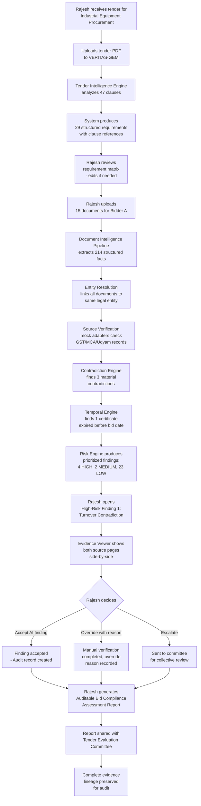
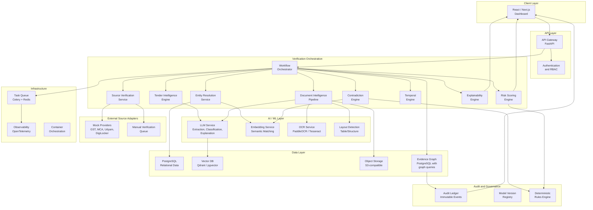
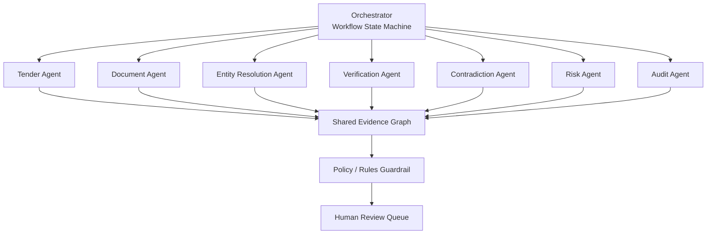
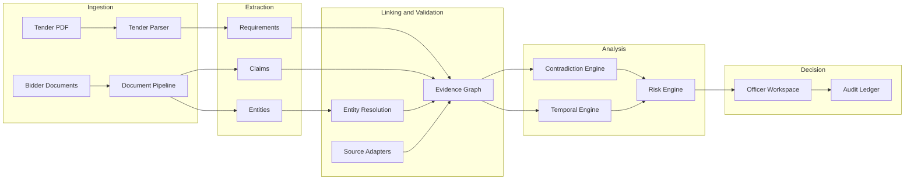
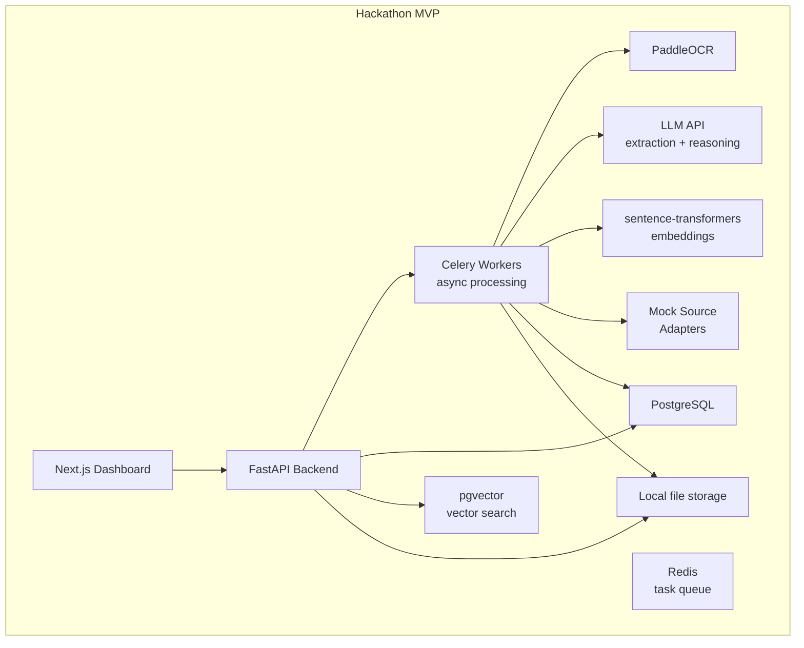
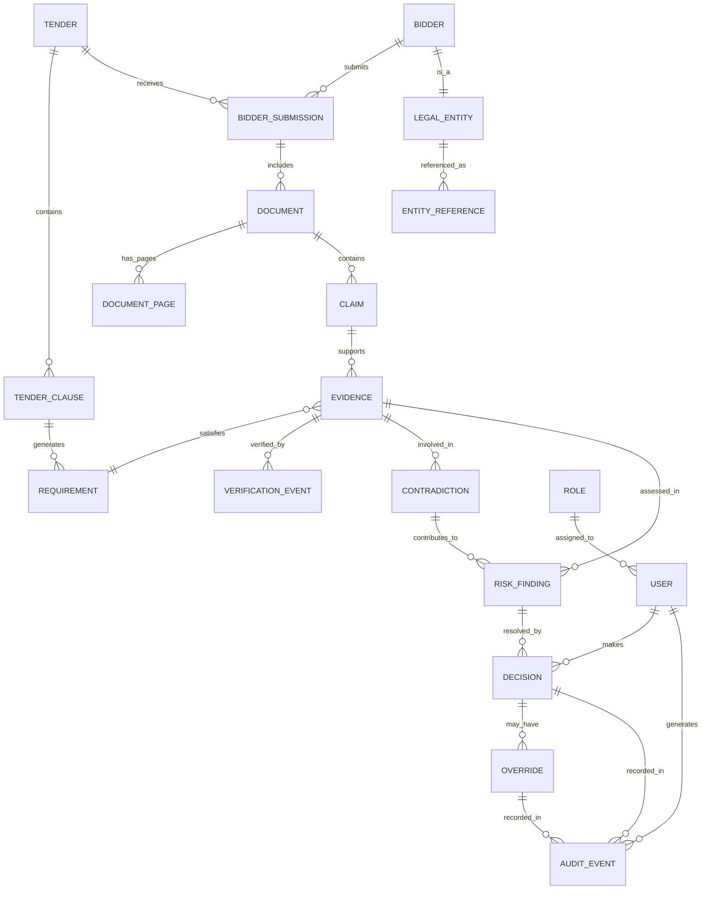

# VERITAS-GEM — Hackathon-Winning Solution Blueprint

## SIH26100 · AI-Powered Integrated Bid Compliance Verification Platform for GeM Procurement

**Ministry of Petroleum & Natural Gas · Smart India Hackathon 2026**

---

# 1. Executive Summary

Government procurement on GeM (Government e-Marketplace) is digitally mediated, but the verification of bidder compliance remains fundamentally manual, evidence-fragmented, and temporally unaware. A procurement officer evaluating a bid must cross-reference dozens of documents, multiple government registrations, time-sensitive certificates, and tender-specific eligibility conditions — a process that is slow, inconsistent, error-prone, and difficult to audit.

**VERITAS-GEM** (Verification, Evidence-Reasoning, Intelligence, Traceability, Audit & Security for GeM) is a bid compliance verification platform that transforms this workflow by introducing an **evidence intelligence layer** between raw procurement data and human decision-making.

The platform's core innovation is the **Bidder Evidence Graph** — a structured, temporal, multi-source representation that links every tender requirement to bidder evidence, validates claims against authoritative sources (or controlled mock adapters for the prototype), detects cross-document contradictions, reconstructs compliance state as of the bid date, and surfaces only the exceptions that require human attention.

The system does not make procurement decisions. It builds the evidentiary case. It shows the officer precisely why a finding exists, what evidence supports it, what conflicts were detected, and what remains unverified. The officer inspects, accepts, overrides, or escalates — and every action is recorded with full evidence lineage for audit.

**What makes this different from a conventional approach:**

| Dimension | Conventional | VERITAS-GEM |
|-----------|-------------|-------------|
| Core model | Document checklist | Evidence graph with temporal reasoning |
| Verification | Manual cross-checking | AI extraction + deterministic validation + source verification |
| Intelligence | OCR + keyword search | Tender-aware requirement mapping + contradiction detection |
| AI role | Generic chatbot / RAG | Specialized, grounded, bounded verification workflow |
| Trust model | Black-box AI score | Decomposable evidence lineage with human decision authority |
| Time handling | Current-state only | Point-in-time compliance reconstruction |

**Product thesis:**

> For procurement officers who struggle with manually cross-verifying bidder documents against tender requirements, VERITAS-GEM is an evidence-backed compliance co-pilot that builds a temporal, multi-source evidence graph for each bidder, detects contradictions invisible to document-by-document review, and surfaces only what requires human attention — unlike static checklists or generic document chatbots — because it reasons over requirements, evidence, sources, and time simultaneously, while keeping the human as the final decision authority.

---

# 2. Problem Intelligence

## 2.1 Core Problem

The stated problem (SIH26100) asks for an AI-powered integrated bid-compliance verification platform for GeM procurement.

The surface reading suggests: "automate document checking."

The deeper problem is:

> **A single compliance determination can depend on multiple documents, multiple authoritative sources, multiple dates, and multiple interpretations of a tender clause. No single document, system, or AI model can produce a trustworthy answer alone.**

Compliance is not a document-existence problem. It is a **relationship + evidence + time + rule** problem.

## 2.2 Root Causes

```
Root Cause                          → Problem                              → Consequence                      → Impact
─────────────────────────────────────────────────────────────────────────────────────────────────────────────────────────
Unstructured tender language         → Ambiguous eligibility conditions      → Inconsistent evaluation           → Procurement disputes
Multiple document types              → Evidence scattered across formats     → Manual cross-referencing          → Slow bid evaluation
No authoritative cross-verification  → Bidder claims taken at face value     → Compliance risk                   → Potential fraud/waste
No temporal modeling                 → Current validity ≠ bid-date validity  → Invalid compliance conclusions    → Legal vulnerability
Decision fragmentation               → Different evaluators see different evidence → Inconsistent outcomes      → Audit failures
No evidence lineage                  → Decisions lack reconstruction trail   → Audit and RTI exposure           → Institutional risk
Static checklists                    → Cannot handle conditional logic       → Rigid, incomplete verification   → Missing nuanced requirements
LLM-only approaches                 → No deterministic validation layer     → Hallucination-dependent trust    → Unreliable conclusions
```

## 2.3 Problem Tree

```
                        ┌─────────────────────────┐
                        │  Evidence Fragmentation  │
                        │  (Root Systemic Problem) │
                        └──────────┬──────────────┘
              ┌────────────────────┼────────────────────┐
              │                    │                     │
    ┌─────────▼──────────┐ ┌──────▼────────┐ ┌─────────▼──────────┐
    │  Document           │ │  Source        │ │  Temporal           │
    │  Fragmentation      │ │  Fragmentation │ │  Fragmentation      │
    │                     │ │                │ │                     │
    │  Certificates,      │ │  Bidder docs   │ │  Validity windows   │
    │  financials,        │ │  vs govt       │ │  differ by date     │
    │  declarations,      │ │  records       │ │                     │
    │  authorizations     │ │                │ │                     │
    └─────────┬──────────┘ └──────┬────────┘ └─────────┬──────────┘
              │                    │                     │
    ┌─────────▼──────────┐ ┌──────▼────────┐ ┌─────────▼──────────┐
    │  Semantic           │ │  Decision      │ │  Audit              │
    │  Fragmentation      │ │  Fragmentation │ │  Gap                │
    │                     │ │                │ │                     │
    │  Same fact,         │ │  Different     │ │  No evidence-backed │
    │  different          │ │  evaluators,   │ │  reconstruction     │
    │  expressions        │ │  different     │ │  of past decisions  │
    │                     │ │  conclusions   │ │                     │
    └─────────┬──────────┘ └──────┬────────┘ └─────────┬──────────┘
              │                    │                     │
              └────────────────────┼─────────────────────┘
                                   │
                        ┌──────────▼──────────────┐
                        │  Slow, inconsistent,     │
                        │  hard-to-audit bid       │
                        │  evaluation              │
                        └──────────┬──────────────┘
                                   │
                        ┌──────────▼──────────────┐
                        │  Government procurement  │
                        │  risk, disputes, waste   │
                        └─────────────────────────┘
```

## 2.4 Current Workflow

A procurement officer currently:

1. Receives a tender with eligibility clauses scattered across sections
2. Manually reads and interprets each clause
3. Constructs a mental or spreadsheet checklist
4. Receives bidder document packages (often 15–50 PDFs per bidder, across multiple bidders)
5. Opens each document individually
6. Visually inspects certificates for expiry dates, entity names, registration numbers
7. Manually cross-checks identifiers (GST number, PAN, company name) across documents
8. Compares financial figures across different statements
9. Checks whether OEM authorization letters match the bidding entity
10. Investigates whether MSME/Startup certificates are current and applicable
11. Attempts to verify registrations against government portals (often manually, portal by portal)
12. Documents findings (inconsistently)
13. Presents evaluation to the Tender Evaluation Committee
14. Committee members may re-inspect documents independently
15. Final decision is recorded with limited evidence trail

**Time estimate (assumption, not measured fact):** For a moderately complex tender with 10+ bidders, each with 15+ documents, this manual process could take days of officer time. This is an assumption based on the problem statement's description; no official government measurement is claimed.

## 2.5 Five Fragmentation Dimensions

| Fragmentation | Example | Why it matters |
|---|---|---|
| Document fragmentation | GST certificate, PAN card, audited financials, OEM letter, MSME certificate, local-content declaration — all separate files | A single requirement may require evidence from multiple documents |
| Source fragmentation | Bidder-submitted documents vs government registry records | A document can exist but its claims can conflict with authoritative records |
| Semantic fragmentation | "Annual turnover" in one document, "Gross revenue from operations" in another | Same economic fact, different terminology |
| Temporal fragmentation | Certificate issued 2024, valid until 2026, bid submitted 2025 — but what if it was suspended in between? | Current validity ≠ bid-date validity |
| Decision fragmentation | Three committee members each reviewing different subsets of evidence | Inconsistent conclusions from the same bidder package |

## 2.6 Stakeholders

| Stakeholder | Role | Primary concern |
|---|---|---|
| Procurement Officer | Evaluates bids | Accuracy + speed + defensibility |
| Tender Evaluation Committee | Collective decision | Consistency across evaluators |
| Compliance/Audit Officer | Post-decision review | Evidence reconstruction |
| Department Administrator | Policy configuration | Rule maintenance |
| Technical Evaluator | Technical clause validation | Specification verification |
| Senior Procurement Authority | Oversight | Risk and throughput visibility |
| Bidders (indirect) | Submit bids | Fair, transparent evaluation |
| CAG/Vigilance (indirect) | Government audit | Procurement integrity |

## 2.7 Impact

- **Financial:** Government procurement on GeM involves substantial public expenditure. Compliance errors — whether false approvals or unjust rejections — create financial and legal risk.
- **Operational:** Manual verification creates bottlenecks that delay procurement timelines.
- **Institutional:** Poor evidence trails expose organizations to RTI queries, vigilance investigations, and audit findings.
- **Trust:** Bidders need confidence that evaluation is fair and evidence-based.

---

# 3. Opportunity Space

## What the problem statement says

> Build an AI platform for bid compliance verification on GeM.

## What it strongly implies but does not say explicitly

1. **The checklist paradigm is broken.** Static checklists cannot handle conditional eligibility ("If the bidder is an MSME, then exemption X applies; otherwise, threshold Y must be met"). The system must reason over applicability.

2. **Document verification alone is insufficient.** Having a GST certificate does not mean the GST number is active, the entity name matches, or the registration was valid on the bid date. Cross-source validation is the real requirement.

3. **Contradictions are the highest-value signal.** An officer can miss a contradiction between two documents in a 40-document package. An automated system that finds "Financial Statement says ₹12 Cr turnover; Vendor Declaration says ₹8 Cr" delivers more value than one that simply confirms documents exist.

4. **Time is a compliance dimension, not just a metadata field.** A certificate that is valid today may not have been valid when the bid was submitted. The problem statement implicitly requires temporal reasoning as a first-class capability.

5. **The system must be trustworthy for government use.** This means explainability, audit trails, human override, and demonstrable security — not a black-box AI score.

6. **The real user need is attention prioritization.** An officer with 10 bidders and 150 documents does not need all 150 documents summarized. They need to know: "Here are the 8 issues that need your attention, ranked by severity, with evidence."

7. **The mock/real integration distinction is critical.** Any team that claims "we integrate with GST/MCA/GeM APIs" without acknowledging that these require government authorization will lose credibility. The architecture must show clean adapter abstraction.

8. **This is a procurement decision-support system, not a procurement decision system.** The AI must never autonomously approve or disqualify a bidder.

---

# 4. Conventional Solution Analysis

## What most hackathon teams will probably build

### Approach A: "AI Document Chatbot"
Upload documents → OCR → stuff into an LLM context → ask questions via chat.

**Why it won't win:** No structured verification. No contradiction detection. No temporal reasoning. No evidence lineage. The LLM hallucinates, and there's no way to trace why it said something. Judges will ask "How do you know the LLM is right?" and the team will have no answer beyond "we used a good model."

### Approach B: "OCR + Static Checklist"
Upload documents → OCR → check against a hardcoded list of required documents → show a compliance dashboard.

**Why it won't win:** Cannot handle conditional requirements. Cannot detect contradictions. Cannot verify against authoritative sources. Cannot handle temporal validity. This is essentially a digitized spreadsheet. Judges will say "This is just document management with a green/red indicator."

### Approach C: "Generic RAG System"
Embed documents → retrieval-augmented generation → ask compliance questions.

**Why it won't win:** RAG retrieves relevant passages but does not validate them. It cannot distinguish between "the document says X" and "X is actually true." It cannot cross-reference multiple documents for consistency. It lacks structured requirement-to-evidence mapping.

### Approach D: "Multi-Agent Hype Architecture"
Deploy 15 AI agents with names like "ComplianceAgent," "FraudAgent," "RecommendationAgent" — each wrapping an LLM call with a different system prompt.

**Why it won't win:** Judges will immediately see through the complexity theatre. "What does each agent actually do differently?" "How do you control agent coordination?" "What happens when agents disagree?" If the answer is "each agent is just a different LLM prompt," the architecture is not genuinely multi-agent — it's a multi-prompt wrapper.

### Approach E: "Dashboard with Analytics"
Upload data → compute statistics → display charts.

**Why it won't win:** No AI depth. No verification. No intelligence. Judges will say "This is a reporting tool, not a compliance verification system."

## The gap all five approaches share

None of them build a **structured evidence model** that connects:

```
Tender Requirement → Bidder Claim → Source Document → Page/Region → Extracted Value → Authoritative Record → Temporal State → Contradiction Signal → Risk → Human Decision
```

That evidence chain is the real product.

---

# 5. Innovation Exploration

Five distinct innovation directions, evaluated against the problem:

| # | Concept | Description | Novelty (1-10) | Feasibility (1-10) | AI Depth (1-10) | Impact (1-10) | Demo Power (1-10) | Scalability (1-10) | **Total** |
|---|---------|-------------|:-:|:-:|:-:|:-:|:-:|:-:|:-:|
| 1 | **Bidder Evidence Graph with Temporal Contradiction Engine** | Build a structured graph linking tender clauses → requirements → evidence → sources → temporal states → contradictions. Focus on cross-document reasoning and point-in-time compliance. | 9 | 8 | 9 | 9 | 10 | 9 | **54** |
| 2 | **Compliance Digital Twin with Simulation** | Model each bidder as a digital twin and simulate "what-if" scenarios (e.g., "what if this certificate expires next month?"). | 8 | 6 | 8 | 7 | 8 | 7 | **44** |
| 3 | **Federated Verification Network** | Create a distributed verification protocol where multiple government registries contribute verification assertions without centralizing data. | 9 | 4 | 7 | 8 | 5 | 8 | **41** |
| 4 | **Procurement Knowledge Graph with Historical Intelligence** | Build a knowledge graph across all past tenders and bidders to identify repeat patterns, serial non-compliance, and risk networks. | 8 | 5 | 8 | 8 | 7 | 9 | **45** |
| 5 | **Multimodal Document Forensics Platform** | Focus on detecting forged/altered certificates using visual anomaly detection, metadata forensics, and QR code verification. | 7 | 7 | 8 | 7 | 9 | 7 | **45** |

### Selection Rationale

**Concept 1 scores highest** because it maximizes the intersection of:
- **Demo power** (contradiction detection is a visually compelling "surprise" moment)
- **Technical feasibility** (graph construction is well-understood; temporal logic is deterministic)
- **AI depth** (combines LLM extraction, embeddings, entity resolution, deterministic validation — not just LLM prompting)
- **Government impact** (directly addresses the evidence-fragmentation problem)
- **Novelty** (no standard hackathon approach builds a temporal evidence graph)

However, the winning solution should **selectively incorporate elements from Concepts 2, 4, and 5**:
- From Concept 2: temporal "what-if" via the Compliance Time Machine slider
- From Concept 4: foundation for historical bidder intelligence in the production roadmap
- From Concept 5: metadata and visual anomaly checks as part of the document intelligence pipeline

---

# 6. Winning Product Concept

## Product Name

**VERITAS-GEM**

*(Verification, Evidence-Reasoning, Intelligence, Traceability, Audit & Security for GeM)*

## Tagline

> **Verify the Evidence. Surface the Risk. Let Humans Decide.**

## Product Category

AI-assisted procurement decision-support platform with evidence graph intelligence.

## Product Thesis

> For **procurement officers and tender evaluation committees** who struggle with **manually cross-verifying dozens of bidder documents against complex tender requirements across multiple sources and time periods**, VERITAS-GEM is a **bid compliance verification platform** that **builds a temporal evidence graph for each bidder, maps tender requirements to validated evidence, detects cross-document contradictions, and surfaces only the exceptions that need human attention** — unlike **static checklists, document chatbots, or generic RAG systems** — because **it reasons over the relationship between requirements, evidence, sources, and time simultaneously, while keeping the human as the authoritative decision-maker with full evidence lineage for audit**.

## Signature Innovation: The Bidder Evidence Graph

### Memorable Name
**Evidence Graph** — a structured, temporal, multi-source representation of a bidder's compliance posture.

### One-Line Explanation
The Evidence Graph connects every tender requirement to its corresponding bidder evidence, validates it against authoritative source records, models its temporal validity, detects cross-document contradictions, and produces a decomposable compliance assessment — all linked to source pages and extraction confidence.

### Why It Matters
Without a structured evidence model, AI compliance verification degenerates into document summarization. The Evidence Graph transforms the problem from "read all the documents" to "here is the evidentiary structure — where are the gaps, conflicts, and risks?"

### How It Works

```
Tender PDF
    ↓ [Tender Intelligence Agent]
Structured Requirements (clause → requirement → evidence type → validation method → criticality)
    ↓
Bidder Documents
    ↓ [Document Intelligence Pipeline]
Structured Claims (entity → field → value → source page → confidence)
    ↓ [Entity Resolution]
Unified Bidder Entity (legal name → registrations → directors → products)
    ↓ [Evidence Linking]
Requirement ←→ Evidence mappings with validation method
    ↓ [Source Verification Adapters]
Authoritative confirmation or mock/simulated verification
    ↓ [Temporal Engine]
Point-in-time validity state (valid-on-bid-date? currently valid? suspended?)
    ↓ [Contradiction Engine]
Cross-document and cross-source inconsistencies flagged
    ↓ [Risk Engine]
Prioritized, decomposable compliance assessment
    ↓ [Explainability Layer]
Evidence-backed findings with "Show Me Evidence" drill-down
    ↓ [Human Decision Workspace]
Accept / Reject / Override / Escalate → Audit Record
```

### Why Competitors Would Struggle to Replicate It
1. The Evidence Graph requires domain-specific schema design for procurement compliance — it is not a generic knowledge graph.
2. The temporal reasoning layer requires modeling validity windows, not just dates.
3. The contradiction engine requires cross-document semantic comparison, not single-document analysis.
4. The trust architecture (evidence lineage + human override + audit) is an integrated design decision, not a bolt-on feature.
5. The adapter abstraction for government source verification requires careful mock/real distinction — teams that claim real API access lose credibility; teams that ignore verification lose depth.

## Core Differentiator

The system transforms procurement verification from:

> **"Open each document → search for the relevant fact → mentally compare across documents"**

to:

> **"Here are the 8 findings that need your attention, ranked by severity, with every evidence link traceable to source pages."**

---

# 7. Why This Is 10× Better

## Before (Current State)

| Step | Action | Time | Risk |
|------|--------|------|------|
| 1 | Read 30+ tender clauses manually | ~60 min | Miss conditional requirements |
| 2 | Build mental/spreadsheet checklist | ~30 min | Incomplete, no conditional logic |
| 3 | Open each of 15+ bidder documents | ~20 min | Documents misclassified |
| 4 | Visually inspect certificates | ~45 min per bidder | Miss expired certificates |
| 5 | Cross-check identifiers manually | ~30 min per bidder | Miss name/number mismatches |
| 6 | Compare financial values across documents | ~20 min per bidder | Miss contradictions |
| 7 | Check registration validity on portals | ~30 min per bidder | No point-in-time checking |
| 8 | Document findings | ~20 min per bidder | Inconsistent evidence trail |
| 9 | Repeat for each bidder | Multiplied by bidder count | Fatigue-induced errors |
| **Total per bidder** | | **~3–5 hours** (assumption) | **Multiple failure modes** |

## After (VERITAS-GEM)

| Step | Action | Time | Risk Mitigation |
|------|--------|------|-----------------|
| 1 | Upload tender → automated requirement extraction | ~2 min | Clause-linked, conditional logic preserved |
| 2 | Upload bidder documents → automated extraction | ~3 min per bidder | OCR + layout detection + classification |
| 3 | System builds Evidence Graph | ~2 min per bidder | Structured, traceable |
| 4 | System runs contradiction detection | ~1 min per bidder | Cross-document, cross-source |
| 5 | System validates temporal compliance | ~30 sec per bidder | Point-in-time reconstruction |
| 6 | Officer reviews prioritized findings | ~15–30 min per bidder | Attention on exceptions only |
| 7 | Accept/Override/Escalate decisions | ~10 min per bidder | Full audit trail |
| **Total per bidder** | | **~30–45 min** (proposed target) | **Evidence-backed, auditable** |

### Proposed improvement factor

- **Time:** ~5–8× faster (assumption based on workflow redesign; actual measurement requires pilot deployment)
- **Consistency:** Elimination of evaluator-dependent variability
- **Contradictions found:** Manual review misses cross-document contradictions that are invisible when documents are reviewed independently
- **Audit quality:** From "I checked the documents" to "here is the evidence chain, the validation method, the confidence, and my decision with reason"

> These are proposed product targets, not claims of measured government-wide performance.

---

# 8. User Personas

| Persona | Description | Daily challenge | What they need from VERITAS-GEM | Success metric |
|---------|-------------|-----------------|-------------------------------|----------------|
| **Procurement Officer (Rajesh)** | Mid-level officer evaluating bids for industrial equipment tenders. 8 years experience. Reviews 3–5 tenders/month. | Spends days manually cross-referencing documents. Worried about missing a critical compliance issue. | Prioritized findings with evidence links. Confidence in coverage. Speed without sacrificing accuracy. | Reviews a 10-bidder tender in 1 day instead of 3 |
| **Tender Evaluation Committee Chair (Sunita)** | Senior officer who chairs the evaluation committee. Needs to ensure all committee members work from the same evidence base. | Committee members reach different conclusions because they inspected different documents. | Consistent evidence package per bidder. Shared compliance matrix. Traceable decision record. | Zero "we didn't see that document" disputes in committee |
| **Compliance Auditor (Vikram)** | Internal audit officer who reviews past procurement decisions. Responsible for responding to CAG/vigilance queries. | Cannot reconstruct why a decision was made 6 months ago. Evidence trail is fragmented across emails and spreadsheets. | Full decision lineage: what was known → what was inferred → what was decided → why. | Can reconstruct any past decision in < 30 min |
| **Department Administrator (Priya)** | IT/Admin officer who maintains department policies. Updates eligibility rules when government circulars change. | When a new GFR rule is issued, she has to manually update every evaluation template. | Configurable rule engine. Update once, apply to all future tenders. | Policy changes deployed in < 1 hour |
| **Technical Evaluator (Arjun)** | Domain engineer who validates technical specifications in bids. Reviews OEM authorizations and product specifications. | Must verify whether an OEM authorization letter actually covers the quoted products and whether the authorizing entity is legitimate. | Entity-matched OEM verification. Product-specification comparison. | Catches OEM authorization mismatches automatically |
| **Senior Procurement Authority (Director-level)** | Oversees procurement across the organization. Concerned about risk exposure and throughput. | No visibility into which tenders have the highest compliance risk. No aggregate metrics. | Dashboard with portfolio-level risk view. Bottleneck identification. | Identifies high-risk tenders before evaluation committee review |

---

# 9. User Journey

## End-to-End Journey: Procurement Officer Rajesh evaluates a tender



### Key interaction patterns

1. **Upload → Automated Analysis → Review exceptions** (not review everything)
2. **Click any finding → see evidence → see source page** (full traceability)
3. **Accept / Override / Escalate** (human always decides)
4. **Time Machine slider** → reconstruct bid-date compliance state
5. **Generate report** → auditable package with decision lineage

---

# 10. Product Architecture



### Architecture Principles

1. **Separation of AI and deterministic layers.** LLMs extract and interpret; rules validate. An LLM response is never treated as evidence — only as an interpretation of evidence.
2. **Adapter pattern for external sources.** Every source verification call goes through a provider interface. The interface is identical whether the provider is a mock, a simulated service, or an authorized government API.
3. **Event-driven processing.** Document upload triggers an asynchronous pipeline. The officer does not wait for each step synchronously.
4. **Evidence-first data model.** Every finding traces back through: finding → evidence → source document → page → extraction method → confidence.
5. **Audit as a first-class architectural layer.** Not logging-as-afterthought. Every state transition, AI inference, human decision, and override is recorded with context.

---

# 11. AI Architecture

## AI Philosophy

> **AI interprets and prioritizes. Authoritative sources and deterministic rules validate. Humans decide.**

Every AI component has a bounded role. No AI component has authorization to approve or disqualify a bidder.

## AI Component Map

| Component | Task | Model/Method | Input | Output | Confidence | Human Action |
|-----------|------|-------------|-------|--------|------------|--------------|
| **Tender Clause Classifier** | Classify tender sections into categories (eligibility, technical, commercial, general) | Transformer / LLM with structured output | Tender text segments | Section classifications with confidence | 0.0–1.0 per classification | Review edge cases |
| **Requirement Extractor** | Extract structured requirements from tender clauses | LLM with schema-constrained generation | Classified tender clauses | JSON requirement objects (clause ref, threshold, evidence type, criticality) | Per-requirement confidence | Verify extracted requirements |
| **Document Classifier** | Classify uploaded bidder documents by type | Vision model + text classification | Document images/text | Document type (GST cert, financial statement, OEM letter, etc.) | Per-document confidence | Correct misclassifications |
| **OCR Engine** | Extract text from scanned documents | PaddleOCR / Tesseract | Document pages (images) | Extracted text with bounding regions | Character-level confidence | Review low-confidence pages |
| **Table Extractor** | Extract structured data from tables in documents | Layout-aware model (table detection + cell extraction) | Document pages with tables | Structured table data (rows, columns, values) | Per-cell confidence | Verify financial tables |
| **Entity Extractor** | Extract named entities, registration numbers, dates, financial values | LLM + NER | Document text | Structured claims (entity name, registration number, date, value) | Per-field confidence | Verify critical extractions |
| **Semantic Matcher** | Match extracted evidence to tender requirements | Embedding similarity (sentence-transformers) | Requirement descriptions + extracted claims | Requirement-to-evidence mappings with similarity scores | Cosine similarity score | Review uncertain matches |
| **Entity Resolution Engine** | Determine whether references across documents refer to the same legal entity | Deterministic identifiers (PAN, GST number, CIN) + embedding similarity for names | Entity references from multiple documents | Unified entity record with match confidence | Match confidence score | Resolve ambiguous matches |
| **Contradiction Detector** | Identify inconsistencies across documents and sources | Rules engine (numeric comparison, date logic) + semantic comparison (embeddings) | Pairs of claims about the same entity/field | Contradiction alerts with severity, evidence pointers | Contradiction severity | Review all material contradictions |
| **Risk Scorer** | Prioritize findings by compliance risk | Hybrid ML/rules model (weighted dimensions: evidence strength, contradiction severity, requirement criticality, temporal validity) | All evidence, contradictions, verification results | Decomposable risk assessment per requirement and per bidder | Per-dimension scores | Review high-risk findings |
| **Explanation Generator** | Produce human-readable explanations for findings | Grounded LLM generation (retrieval from evidence store, not free generation) | Finding + supporting evidence + contradiction data | Natural language explanation with evidence citations | N/A (grounding prevents fabrication) | Verify explanation accuracy |

## Grounding Rule

```
LLM output is NOT Evidence

Evidence must come from:
├── Source document (uploaded by bidder)
├── Authoritative record (from verified/mock source adapter)
├── Deterministic calculation (rule-based comparison)
└── Validated extracted fact (with extraction confidence)

LLM produces:
├── Interpretation of evidence
├── Classification
├── Structured extraction
└── Human-readable explanation

LLM does NOT produce:
├── Compliance decisions
├── Evidence assertions without source
├── Fabricated facts
└── Legal conclusions
```

## AI Pipeline Flow


---

# 12. Agent Architecture

Agents are used because the verification workflow involves multiple specialized tasks that benefit from bounded, tool-equipped processes with clear inputs, outputs, and failure handling. Each agent is a task-specialized, policy-constrained component — not a generic LLM wrapper.

## Agent Design



## Agent Specifications

### Tender Agent
| Attribute | Value |
|-----------|-------|
| **Objective** | Convert tender PDF into structured requirement matrix |
| **Input** | Tender PDF |
| **Tools** | OCR service, LLM (structured extraction), document parser |
| **Permissions** | Read tender documents, write to requirement store |
| **Memory** | Current tender context only |
| **Output** | Structured requirements with clause references |
| **Validation** | Schema validation of output; human review of extracted requirements |
| **Failure handling** | If extraction confidence is below threshold, flag for human review; never fabricate requirements |
| **Human approval** | Officer reviews and confirms requirement matrix before proceeding |

### Document Agent
| Attribute | Value |
|-----------|-------|
| **Objective** | Process bidder documents into structured claims and evidence |
| **Input** | Uploaded bidder document files |
| **Tools** | OCR, layout detection, table extraction, LLM (entity/claim extraction) |
| **Permissions** | Read uploaded documents, write to evidence store |
| **Memory** | Current bidder document context |
| **Output** | Structured claims with page/region references and confidence |
| **Validation** | Schema validation; confidence thresholds; format checks |
| **Failure handling** | Low-confidence pages flagged for manual review; unreadable documents marked as "unable to process" |
| **Human approval** | Not required per-document; officer reviews at finding level |

### Entity Resolution Agent
| Attribute | Value |
|-----------|-------|
| **Objective** | Determine whether references across documents represent the same legal entity |
| **Input** | Entity references extracted from all bidder documents |
| **Tools** | Deterministic identifier matching, embedding similarity |
| **Permissions** | Read entity records from all documents for one bidder |
| **Memory** | Current bidder entity context |
| **Output** | Unified entity record with match confidence and discrepancy flags |
| **Validation** | Exact-match identifiers must agree; fuzzy name matches require confidence threshold |
| **Failure handling** | Ambiguous matches flagged for human resolution |
| **Human approval** | Required for ambiguous entity matches |

### Verification Agent
| Attribute | Value |
|-----------|-------|
| **Objective** | Verify extracted claims against authoritative source records |
| **Input** | Claims requiring external verification |
| **Tools** | Source adapter interface (mock/simulated/real providers) |
| **Permissions** | Call source adapters; cannot modify source records |
| **Memory** | Current verification request context |
| **Output** | Verification result (confirmed / discrepancy / unable to verify) with source reference |
| **Validation** | Source response schema validation; adapter health check |
| **Failure handling** | If source is unavailable: status = "unable to verify" (never "compliant") |
| **Human approval** | Required for discrepancies between bidder documents and source records |

### Contradiction Agent
| Attribute | Value |
|-----------|-------|
| **Objective** | Detect semantic and numerical inconsistencies across documents and sources |
| **Input** | All claims, evidence, and verification results for one bidder |
| **Tools** | Rules engine (numeric comparison, date logic), semantic comparison (embeddings) |
| **Permissions** | Read-only access to evidence graph |
| **Memory** | Current bidder evidence context |
| **Output** | Contradiction alerts with severity, evidence pointers, category |
| **Validation** | Contradictions require at least two conflicting evidence items |
| **Failure handling** | If comparison is inconclusive, flag as "potential inconsistency — human review recommended" |
| **Human approval** | All material contradictions require human review |

### Risk Agent
| Attribute | Value |
|-----------|-------|
| **Objective** | Produce prioritized, decomposable compliance assessment |
| **Input** | Evidence graph, contradictions, verification results, temporal states |
| **Tools** | Rules engine, weighted scoring model |
| **Permissions** | Read-only access to evidence graph and contradictions |
| **Memory** | Current bidder assessment context |
| **Output** | Per-requirement and per-bidder risk scores with dimension breakdown |
| **Validation** | Every score must decompose into constituent dimensions |
| **Failure handling** | Insufficient evidence leads to dimension marked "unable to assess" |
| **Human approval** | Officer reviews all high-risk findings |

### Audit Agent
| Attribute | Value |
|-----------|-------|
| **Objective** | Record every state transition, AI inference, and human decision |
| **Input** | Events from all other agents and human interactions |
| **Tools** | Audit ledger (append-only) |
| **Permissions** | Write to audit ledger; cannot modify or delete past entries |
| **Memory** | None (stateless recorder) |
| **Output** | Immutable audit events with full context |
| **Validation** | Event schema validation; completeness checks |
| **Failure handling** | Audit write failure = system-level alert (audit integrity is non-negotiable) |
| **Human approval** | Not applicable — audit is automatic |

## Agent Restrictions (Non-Negotiable)

Agents **cannot:**
- Approve or disqualify bidders
- Modify authoritative source records
- Invent or fabricate evidence
- Suppress contradictory evidence
- Bypass access control
- Make final compliance determinations

Agents **can:**
- Extract structured data from documents
- Classify documents and claims
- Compare claims across documents and sources
- Prioritize findings by risk
- Recommend actions (verify, review, escalate)
- Request additional evidence or human input

---

# 13. Data Architecture

## Data Sources

| Source Type | Examples | Classification | MVP Handling |
|------------|----------|---------------|-------------|
| User-generated | Tender uploads, bidder document uploads | Bidder/Tender Data | Real upload |
| Government/public | GST registration, MCA records, Udyam registration, NSIC certificates | Authoritative Data | Mock adapters |
| Structured | Extracted tables, financial statements, registration numbers | Extracted Data | AI + deterministic extraction |
| Unstructured | Scanned certificates, handwritten notes, stamps | Document Data | OCR + layout detection |
| Temporal | Certificate validity dates, registration status history, bid timelines | Temporal Data | Date-logic engine |
| Transactional | Officer decisions, overrides, escalations, committee votes | Decision Data | Real |
| Audit | Every system event, model version, rule version | Audit Data | Append-only ledger |

## Data Intelligence Pipeline

```
Data → Intelligence → Decision → Action
─────────────────────────────────────────
Raw PDF             → Structured claims      → Compliance finding    → Officer review
Registration cert   → Extracted GST/PAN      → Identity match        → Entity verified
Financial statement → Extracted turnover      → Threshold comparison  → Requirement check
Multiple documents  → Cross-doc comparison    → Contradiction         → Manual verification
Authority record    → Source verification     → Confirm/discrepancy   → Risk adjustment
Certificate dates   → Temporal reconstruction → Bid-date validity     → Temporal finding
```

## Data Quality Mechanisms

| Mechanism | Implementation |
|-----------|---------------|
| Validation | Schema validation on all AI extractions; type/format checks |
| Deduplication | Duplicate document detection via content hashing + metadata comparison |
| Entity resolution | Deterministic identifiers (PAN, GST number, CIN) + embedding-based name matching |
| Provenance | Every data point traced to source document, page, extraction method |
| Confidence | Extraction confidence scores per field; verification confidence per source check |
| Freshness | Temporal modeling of certificate validity; bid-date relevance check |
| Conflict resolution | Contradictions surfaced for human resolution; never auto-resolved for material issues |

## Data Flow Diagram



---

# 14. Core Product Features (MoSCoW)

## Must Have (Hackathon MVP)

| Feature | Complexity | Demo Value | User Value | Technical Dependency |
|---------|:----------:|:----------:|:----------:|:-------------------:|
| Tender PDF upload and parsing | Medium | Medium | High | OCR/Parser |
| Tender clause extraction and requirement generation | High | High | High | LLM |
| Bidder document upload (multi-file) | Low | Medium | High | Storage |
| Document classification (auto-detect type) | Medium | Medium | High | Vision/LLM |
| OCR for scanned documents | Medium | Medium | High | PaddleOCR |
| Structured evidence extraction (entities, values, dates) | High | High | High | LLM + NER |
| Evidence-to-requirement mapping | High | High | High | Embeddings + rules |
| Entity resolution across documents | High | High | High | Identifiers + embeddings |
| Mock source verification adapters | Medium | High | High | Adapter pattern |
| Cross-document contradiction detection | High | **Very High** | High | Rules + semantic |
| Temporal validity checking | Medium | **Very High** | High | Date logic |
| Decomposable risk scoring (not a single opaque number) | Medium | High | High | Rules + scoring |
| Explainable findings ("Show Me Evidence") | Medium | **Very High** | High | Evidence retrieval |
| Officer review workspace (Accept/Reject/Override/Escalate) | Medium | High | High | UI + audit |
| Human override with mandatory reason | Low | High | High | UI + audit |
| Audit log with evidence lineage | Medium | High | High | Append-only store |
| Compliance assessment report generation | Medium | High | High | Report service |

## Should Have (Enhanced Demo)

| Feature | Complexity | Demo Value | User Value |
|---------|:----------:|:----------:|:----------:|
| Compliance Time Machine slider (visual timeline) | Medium | Very High | High |
| Contradiction Radar visualization (graph view) | Medium | High | Medium |
| Side-by-side source page viewer | Low | High | High |
| Dashboard with bidder cards and summary metrics | Medium | High | Medium |
| Confidence indicators on all AI outputs | Low | Medium | High |
| Document quality indicators (OCR confidence per page) | Low | Medium | Medium |

## Could Have (If Time Permits)

| Feature | Complexity | Demo Value | User Value |
|---------|:----------:|:----------:|:----------:|
| QR code validation on certificates | Medium | Medium | Medium |
| Visual anomaly detection on stamps/signatures | High | High | Medium |
| Committee workflow (multi-reviewer) | Medium | Medium | High |
| Notification system (priority-based alerts) | Low | Low | Medium |
| Bidder comparison view | Medium | Medium | Medium |

## Future (Production Only)

| Feature | Complexity | User Value |
|---------|:----------:|:----------:|
| Authorized government API integrations | High | Very High |
| Multi-tenant deployment | High | High |
| Historical bidder intelligence (cross-tender patterns) | High | High |
| Configurable policy/rules management UI | High | High |
| Model governance platform | High | High |
| Federated data architecture | Very High | High |

---

# 15. UX and Screen Architecture

## Design Principle

> The homepage answers one question: **"Where do I need to spend my attention?"**

The AI should feel **powerful but understandable.** Every AI conclusion is traceable. Nothing is a black box.

## Screen Architecture

### Screen 1: Tender Upload and Analysis

**User Goal:** Start a new compliance evaluation.

**Flow:**
```
User Action    → Drag-and-drop tender PDF
System Intel   → "Analyzing 47 clauses..."
                 "29 compliance requirements identified"
                 "6 mandatory, 12 high-criticality, 11 standard"
Result         → Compliance Requirements Matrix displayed
Next Action    → Review requirements → Upload bidder documents
```

### Screen 2: Compliance Requirements Matrix

**User Goal:** See all requirements extracted from this tender.

**Layout:**
```
┌──────────────────────────────────────────────────────────────────────┐
│  Tender: Procurement of Industrial Equipment (T-2026-0847)          │
│  29 Requirements Identified | 6 Mandatory | Source: Clause-linked   │
├──────┬──────────────────────────┬──────────────┬─────────┬──────────┤
│Clause│ Requirement              │ Evidence Type│ Method  │Criticality│
├──────┼──────────────────────────┼──────────────┼─────────┼──────────┤
│ 4.1  │ Valid GST registration   │ GST cert     │ Source  │ High     │
│ 4.2  │ Min turnover Rs 10 Cr   │ Financials   │ Numeric │ High     │
│ 4.3  │ OEM authorization       │ OEM letter   │ Entity  │ Medium   │
│ 4.4  │ Local content >= 50%    │ Declaration  │ Rule    │ High     │
│ 4.5  │ Not blacklisted         │ Declaration  │ Source  │ Mandatory│
│ ...  │ ...                     │ ...          │ ...     │ ...      │
└──────┴──────────────────────────┴──────────────┴─────────┴──────────┘
```

### Screen 3: Executive Dashboard

**User Goal:** See overall compliance status across all bidders.

**Layout:**
```
┌──────────────────────────────────────────────────────────────────────┐
│  VERITAS-GEM                                                         │
│  Tender: Procurement of Industrial Equipment                         │
├──────────────────────────────────────────────────────────────────────┤
│                                                                      │
│  Bidders           High-Risk Findings      Verified                  │
│    12                    7                   78%                      │
│                                                                      │
│  Needs Review      Contradictions          Avg AI Time               │
│    14%                   5                  6m 21s                    │
│                                                                      │
├──────────────────────────────────────────────────────────────────────┤
│  BIDDER CARDS (sorted by risk)                                       │
│                                                                      │
│  ┌─────────────────┐  ┌─────────────────┐  ┌─────────────────┐      │
│  │ ABC INDUSTRIES  │  │ XYZ CORP LTD    │  │ PQR ENGG PVT   │      │
│  │                 │  │                 │  │                 │      │
│  │ Risk: HIGH      │  │ Risk: MEDIUM    │  │ Risk: LOW       │      │
│  │ Findings: 3     │  │ Findings: 1     │  │ Findings: 0     │      │
│  │ Contradictions:2│  │ Contradictions:1│  │ Contradictions:0│      │
│  │ Evidence: 91%   │  │ Evidence: 88%   │  │ Evidence: 96%   │      │
│  │                 │  │                 │  │                 │      │
│  │ [Review Bidder] │  │ [Review Bidder] │  │ [Review Bidder] │      │
│  └─────────────────┘  └─────────────────┘  └─────────────────┘      │
└──────────────────────────────────────────────────────────────────────┘
```

### Screen 4: Bidder Compliance View

**User Goal:** Review one bidder's compliance status across all requirements.

**Layout:**
```
┌──────────────────────────────────────────────────────────────────────┐
│  Bidder: ABC Industries Ltd                                          │
│  CIN: U12345MH2010PTC123456 | GST: 27AAACB1234A1Z5                 │
├──────────────────────────────────────────────────────────────────────┤
│  Compliance Scorecard (decomposed)                                   │
│  - Mandatory Requirements:  100%                                     │
│  - Evidence Strength:        91%                                     │
│  - Source Verification:      84%                                     │
│  - Identity Consistency:    100%                                     │
│  - Temporal Validity:        96%                                     │
│  - Contradiction Risk:     MEDIUM                                    │
├──────────────────────────────────────────────────────────────────────┤
│  FINDINGS (sorted by risk)                                           │
│                                                                      │
│  HIGH  Turnover Contradiction                           [Review]     │
│  HIGH  GST Name Mismatch                               [Review]     │
│  MED   OEM Authorization — Partial Match                [Review]     │
│  LOW   MSME Certificate — Verified                     [Accepted]    │
│  LOW   PAN — Verified                                  [Accepted]    │
│  ...                                                                 │
└──────────────────────────────────────────────────────────────────────┘
```

### Screen 5: Evidence Viewer (Three-Column Layout)

**User Goal:** Inspect a specific finding with full evidence chain.

**Layout:**
```
┌────────────────┬────────────────────┬──────────────────────────┐
│  REQUIREMENT   │  EVIDENCE          │  SOURCE DOCUMENT         │
│                │                    │                          │
│  Clause 4.2    │  Finding:          │  [PDF Page Viewer]       │
│  Min Turnover  │  MATERIAL          │                          │
│  >= Rs 10 Cr   │  CONTRADICTION     │  Financial Statement     │
│                │                    │  Page 17                 │
│  Criticality:  │  Doc A (Financial):│  ┌────────────────────┐  │
│  HIGH          │  Turnover=Rs 12 Cr │  │                    │  │
│                │  Confidence: 0.97  │  │   [Highlighted      │  │
│  Validation:   │                    │  │    region showing   │  │
│  Numeric       │  Doc B (Vendor     │  │    Rs 12 Cr]       │  │
│  comparison    │  Declaration):     │  │                    │  │
│                │  Turnover=Rs 8 Cr  │  └────────────────────┘  │
│                │  Confidence: 0.94  │                          │
│                │                    │  Vendor Declaration      │
│                │  Contradiction:    │  Page 3                  │
│                │  MATERIAL          │  ┌────────────────────┐  │
│                │  (Rs 4 Cr gap)     │  │                    │  │
│                │                    │  │   [Highlighted      │  │
│                │  Source Check:     │  │    region showing   │  │
│                │  Mock adapter —    │  │    Rs 8 Cr]        │  │
│                │  Not available     │  │                    │  │
│                │                    │  └────────────────────┘  │
│                │                    │                          │
│  ┌──────────────────────────────────────────────────────────┐  │
│  │  AI Recommendation: MANUAL VERIFICATION REQUIRED         │  │
│  │                                                          │  │
│  │  [Accept Finding]  [Override]  [Escalate to Committee]   │  │
│  └──────────────────────────────────────────────────────────┘  │
└────────────────┴────────────────────┴──────────────────────────┘
```

### Screen 6: Compliance Time Machine

**User Goal:** Verify whether evidence was valid on the bid submission date.

**Layout:**
```
┌──────────────────────────────────────────────────────────────────────┐
│  Compliance Time Machine — ABC Industries Ltd                        │
│                                                                      │
│  Timeline:                                                           │
│  2024 ─────────── 2025 ─────────── 2026 ─────────── 2027            │
│                                          ^                           │
│                                   Bid Submission                     │
│                                   (15-Sep-2026)                      │
│                                                                      │
│  GST Registration    [=============================]  VALID          │
│  BIS Certificate     [===================..........]  EXPIRED        │
│  MSME Certificate    [=============================]  VALID          │
│  OEM Authorization   [==========================..]  VALID           │
│  Pollution Cert      [===========.................]  EXPIRED         │
│                                          ^                           │
│                                                                      │
│  WARNING: BIS Certificate expired 3 months BEFORE bid submission     │
│  WARNING: Pollution Certificate expired 14 months BEFORE bid sub     │
│                                                                      │
│  [Drag slider to any date to reconstruct compliance state]           │
└──────────────────────────────────────────────────────────────────────┘
```

### Screen 7: Contradiction Radar

**User Goal:** See all contradictions for a bidder visually.

**Layout:**
```
┌──────────────────────────────────────────────────────────────────────┐
│  Contradiction Radar — ABC Industries Ltd                            │
│                                                                      │
│  3 Contradictions Detected                                           │
│                                                                      │
│  ┌─ Turnover ──────────────────────────────────────────────┐         │
│  │  Financial Statement (p.17):  Rs 12,00,00,000           │         │
│  │  Vendor Declaration (p.3):    Rs 8,00,00,000            │         │
│  │  Gap: Rs 4,00,00,000                                    │         │
│  │  Severity: MATERIAL                          [View]     │         │
│  └─────────────────────────────────────────────────────────┘         │
│                                                                      │
│  ┌─ Legal Name ────────────────────────────────────────────┐         │
│  │  GST Certificate:    "ABC Industries Limited"           │         │
│  │  PAN Card:           "ABC Industries Pvt Ltd"           │         │
│  │  Difference: "Limited" vs "Pvt Ltd"                     │         │
│  │  Severity: HIGH                              [View]     │         │
│  └─────────────────────────────────────────────────────────┘         │
│                                                                      │
│  ┌─ Employee Count ────────────────────────────────────────┐         │
│  │  MSME Certificate:   42 employees                       │         │
│  │  EPF Declaration:    67 employees                       │         │
│  │  Difference: 25 employees                               │         │
│  │  Severity: MEDIUM                            [View]     │         │
│  └─────────────────────────────────────────────────────────┘         │
└──────────────────────────────────────────────────────────────────────┘
```

### Screen 8: Human Decision Center

**User Goal:** Make and record compliance decisions.

**Flow:**
```
User Action    → Reviews finding with evidence
System Intel   → AI Recommendation: "Review Required — Material turnover contradiction"
Result         → Officer clicks one of:
                 [Accept Finding] — agrees with AI assessment
                 [Reject Finding] — disagrees (reason required)
                 [Override]       — provides alternative conclusion (reason required)
                 [Escalate]       — sends to committee review
Next Action    → Decision recorded in audit ledger with:
                 officer ID, timestamp, finding ID, action taken,
                 reason text, evidence version, model version
```

---

# 16. Trust, Security and Governance

## Trust Architecture

For any finding that influences a procurement decision:

```
Evidence → AI Analysis → Confidence → Explanation → Human Review → Decision → Audit
```

No step can be skipped. No finding reaches the officer without evidence backing.

## Threat Model and Controls

| Threat | Attack Vector | Control | Implementation |
|--------|--------------|---------|----------------|
| Unauthorized access | Credential theft, session hijacking | RBAC + least privilege + session controls | Keycloak/Auth0; JWT tokens; session expiry |
| Data leakage | Unauthorized data access across tenants | Encryption at rest + in transit; tenant isolation | AES-256 encryption; row-level security in PostgreSQL |
| Prompt injection | Malicious content embedded in bidder PDFs | Document content treated as untrusted data, never as LLM instructions | Content sanitization; instruction-data separation in prompts |
| Malicious files | Virus/malware in uploaded documents | AV scanning + sandboxed parsing | ClamAV scan before processing; isolated parser containers |
| LLM hallucination | Model generates false compliance conclusions | Schema validation + evidence grounding + deterministic checks | Structured outputs; every claim must cite source document/page |
| Data poisoning | Tampered training data or reference data | Source provenance + anomaly monitoring | Mock data with known-good values; anomaly checks on inputs |
| Insider threat | Authorized user makes unauthorized changes | Immutable audit trail | Append-only audit events; cannot delete or modify past records |
| Model drift | Model accuracy degrades over time | Model version registry + evaluation datasets | Every inference records model version; periodic accuracy checks |
| API abuse | Rate-based attacks on API endpoints | Rate limiting + API key management | Rate limiter middleware; per-user quotas |
| Unauthorized decisions | AI autonomously approves/disqualifies | Human approval gate | No agent has permission to finalize compliance; all material findings require human action |

## AI Governance

The system follows a lifecycle-based AI risk management approach:

1. **Govern:** Define acceptable AI behaviors, decision boundaries, and human oversight requirements
2. **Map:** Identify where AI is used, what decisions it influences, and what risks exist
3. **Measure:** Track extraction accuracy, false positive/negative rates, confidence calibration, grounding quality
4. **Manage:** Version all models, prompts, rules, and embeddings; evaluate regularly; human override always available

## Explainability Requirements

Every material finding must provide:

- **What was checked** (requirement description)
- **What evidence was used** (document reference, page, extracted value)
- **What external verification was performed** (source adapter name and result)
- **What conflicts were found** (contradiction details)
- **What confidence the system has** (numeric confidence with dimension breakdown)
- **What validation method was used** (deterministic / AI / hybrid)
- **What the system recommends** (verify / accept / escalate)

## Auditability

Every auditable event records:

```json
{
  "event_id": "AUD-88423",
  "event_type": "FINDING_REVIEWED",
  "user": "officer-17",
  "action": "OVERRIDE_FINDING",
  "finding_id": "RISK-102",
  "reason": "Manual certificate verification completed — original in hand",
  "timestamp": "2026-09-15T14:23:17Z",
  "model_version": "veritas-0.9.3",
  "rule_version": "rules-1.2",
  "evidence_version": "EV-1203",
  "session_id": "sess-a8f2c",
  "ip_address": "10.0.1.45"
}
```

The audit layer enables reconstruction of:

> **What the system knew → what it inferred → what it showed → what the human decided → why**

---

# 17. MVP Architecture

## What will be built during the hackathon

The MVP demonstrates the complete verification pipeline for **one tender with multiple bidders**, using **mock source adapters** for external verification.

### MVP Scope

```
INPUT:
  - One tender PDF (30+ clauses)
  - Multiple bidder document packages (15+ documents each)
  - Mock authoritative source data

PROCESSING:
  - Tender requirement extraction (AI + schema validation)
  - Document parsing + OCR + evidence extraction (AI + deterministic)
  - Entity resolution (identifiers + embeddings)
  - Mock source verification (adapter pattern)
  - Cross-document contradiction detection (rules + semantic)
  - Temporal validity checking (date logic)
  - Risk scoring (hybrid rules + weighted model)
  - Grounded explanation generation (LLM with evidence retrieval)

OUTPUT:
  - Compliance requirements matrix
  - Bidder evidence graph
  - Prioritized findings with evidence links
  - Contradiction alerts with source page references
  - Temporal compliance view
  - Human decision workspace
  - Audit trail
  - Compliance assessment report
```

### MVP Architecture Diagram



### What is NOT in the MVP

- Real government API integrations
- Multi-tenant architecture
- Production-grade auth (basic RBAC only)
- Historical bidder intelligence
- Advanced visual forensics (stamp/signature analysis)
- Federated data
- Model governance dashboard

---

# 18. Production Architecture

## How the MVP evolves

```mermaid
flowchart LR
    subgraph HACK["Hackathon"]
        H1["Mock adapters"]
        H2["Single-node"]
        H3["Local storage"]
        H4["Basic auth"]
        H5["PostgreSQL graph model"]
    end

    subgraph PILOT["Pilot: 3-6 months"]
        P1["First approved\nintegrations"]
        P2["Container\norchestration"]
        P3["S3-compatible\nstorage"]
        P4["Keycloak RBAC"]
        P5["Expanded\nrule engine"]
    end

    subgraph PROD["Production: 6-18 months"]
        PR1["Multiple authorized\ngovernment APIs"]
        PR2["Multi-zone\ndeployment"]
        PR3["Encrypted\nbackup/DR"]
        PR4["MFA + SSO"]
        PR5["Neo4j or\ndedicated graph DB"]
        PR6["Model governance\nplatform"]
        PR7["Multi-tenant\nisolation"]
    end

    subgraph INTEL["Intelligence: 18+ months"]
        I1["Cross-tender\npatterns"]
        I2["Historical bidder\nintelligence"]
        I3["Risk network\nanalysis"]
        I4["Federated\ndata architecture"]
    end

    HACK --> PILOT --> PROD --> INTEL
```



### Key scaling mechanism

The adapter pattern means:

```
MockGSTProvider      → AuthorizedGSTProvider
MockMCAProvider      → AuthorizedMCAProvider
MockUdyamProvider    → AuthorizedUdyamProvider
MockDigiLocker       → PartnerDigiLockerAPI
```

The UI, evidence model, and officer workflow do not change. Only the adapter implementation changes.

---

# 19. Technology Stack

| Layer | Technology | Purpose | Why This Choice |
|-------|-----------|---------|-----------------|
| **Frontend** | Next.js + React + TypeScript | Dashboard, evidence viewer, decision workspace | SSR for fast initial load; TypeScript for reliability; React ecosystem for component richness |
| **UI Components** | Tailwind CSS + shadcn/ui | Rapid, polished UI development | Consistent design system; accessible components; fast iteration |
| **Backend** | Python + FastAPI | API layer + AI orchestration | Python is the lingua franca for AI/ML; FastAPI provides async support + auto-generated API docs |
| **Task Queue** | Celery + Redis | Async document processing | Document pipelines are long-running; officers should not wait synchronously |
| **Database** | PostgreSQL | Relational data (tenders, bidders, requirements, evidence, decisions, audit) | Battle-tested; supports JSON for semi-structured data; row-level security for access control |
| **Vector DB** | pgvector (MVP) / Qdrant (production) | Semantic similarity search for requirement-evidence matching | pgvector avoids additional infrastructure in MVP; Qdrant scales for production workloads |
| **Graph Model** | PostgreSQL recursive CTEs (MVP) / Neo4j (production) | Evidence graph traversal and contradiction detection | PostgreSQL is sufficient for MVP graph queries; Neo4j provides native graph performance at scale |
| **Object Storage** | Local filesystem (MVP) / S3-compatible (production) | Document and page image storage | Simple in MVP; S3-compatible storage scales and provides redundancy |
| **OCR** | PaddleOCR | Text extraction from scanned documents | Open-source; strong multi-language support; good accuracy on Indian documents |
| **Document Parsing** | PyMuPDF + pdfplumber | PDF text extraction, layout detection, table extraction | Handles both native and scanned PDFs; pdfplumber excels at table extraction |
| **LLM** | Strong API model (e.g., Gemini, GPT-4-class) or local open-weight model | Clause classification, requirement extraction, entity extraction, grounded explanation | API model for MVP reliability; open-weight option for cost control and data sovereignty in production |
| **Embeddings** | sentence-transformers (all-MiniLM-L6-v2 or similar) | Semantic matching for requirement-evidence linking, entity name comparison | Fast inference; good quality for English text; runs locally |
| **ML** | XGBoost / LightGBM (if trained) or rules-based scoring | Risk scoring model | Gradient boosted trees for structured risk features; rules-based for MVP simplicity |
| **Agent Orchestration** | LangGraph or custom state machine | Controlled agent workflow with explicit state transitions | LangGraph provides structured graph-based workflows; custom state machine is simpler if LangGraph adds unnecessary complexity |
| **Auth** | Basic JWT (MVP) / Keycloak (production) | Authentication + RBAC | JWT is sufficient for hackathon; Keycloak provides enterprise-grade identity management |
| **Deployment** | Docker + docker-compose | Containerization | Portable; reproducible; easy demo deployment |
| **Observability** | Basic logging (MVP) / OpenTelemetry + Prometheus (production) | System monitoring, tracing, alerting | Logging is sufficient for hackathon; OpenTelemetry provides production observability |

### Technology Selection Principle

Every component in this stack has a defensible purpose. No technology is included for its buzzword value.

---

# 20. API and Integration Strategy

## Core REST APIs

| Endpoint | Method | Purpose | Status |
|----------|--------|---------|--------|
| `/tenders` | POST | Upload tender document | Real |
| `/tenders/{id}/analyze` | POST | Trigger tender analysis | Real |
| `/tenders/{id}/requirements` | GET | Get extracted requirements | Real |
| `/bidders` | POST | Create bidder record | Real |
| `/bidders/{id}/documents` | POST | Upload bidder documents | Real |
| `/bidders/{id}/compliance` | GET | Get compliance assessment | Real |
| `/bidders/{id}/evidence-graph` | GET | Get evidence graph | Real |
| `/findings/{bidder_id}` | GET | Get all findings for a bidder | Real |
| `/findings/{id}/evidence` | GET | Get evidence chain for a finding | Real |
| `/findings/{id}/decision` | POST | Record officer decision | Real |
| `/findings/{id}/override` | POST | Record override with reason | Real |
| `/verification/source` | POST | Trigger source verification | Real |
| `/audit/{bidder_id}` | GET | Get audit trail for a bidder | Real |
| `/reports/{bidder_id}` | GET | Generate compliance report | Real |

## Source Verification Adapters

| Source | MVP Mode | Production Mode | Adapter Class |
|--------|----------|-----------------|---------------|
| GeM | Mock — imported sample data | Authorized GeM integration (requires government approval) | `MockGeMProvider` to `AuthorizedGeMProvider` |
| GST verification | Simulated adapter — returns predetermined verification results | Approved integration where available | `MockGSTProvider` to `AuthorizedGSTProvider` |
| MCA (Company info) | Mock dataset — sample company records | Authorized MCA21 interface | `MockMCAProvider` to `AuthorizedMCAProvider` |
| DigiLocker | Simulated — mimics document verification flow | Partner API integration (requires formal requester credentials) | `MockDigiLockerProvider` to `DigiLockerProvider` |
| Udyam (MSME) | Mock — sample MSME records | Authorized Udyam integration | `MockUdyamProvider` to `AuthorizedUdyamProvider` |
| Startup India (DPIIT) | Mock — sample startup registrations | Approved integration | `MockStartupProvider` to `AuthorizedStartupProvider` |
| NSIC / BIS | Mock — sample certificate records | Approved integration | `MockNSICProvider` to `AuthorizedNSICProvider` |
| Blacklist/Debarment | Curated dataset — known debarred entities | Authorized data exchange | `MockBlacklistProvider` to `AuthorizedBlacklistProvider` |
| Manual verification | Human verification queue | Human verification queue | `ManualVerificationProvider` |

### Adapter Interface

```python
class VerificationProvider:
    """Abstract base for all source verification adapters."""

    def verify(self, request: VerificationRequest) -> VerificationResult:
        raise NotImplementedError

    def health_check(self) -> bool:
        raise NotImplementedError

    @property
    def provider_type(self) -> str:
        """Returns: 'real' | 'mock' | 'simulated' | 'manual'"""
        raise NotImplementedError
```

The UI displays the provider type badge on every verification result, so the officer always knows whether a verification is real, mocked, or simulated. This prevents misrepresentation.

## Internal Event Model

```
TenderUploaded → TenderAnalysisStarted → RequirementsExtracted
DocumentUploaded → DocumentClassified → DocumentParsed → ClaimsExtracted
EvidenceLinked → VerificationRequested → VerificationCompleted
EntityResolved → ContradictionDetected → RiskCalculated
FindingPresented → FindingReviewed → DecisionRecorded
OverrideRecorded → AuditEventCreated → ReportGenerated
```

---

# 21. Database and Data Model

## Core Relational Schema



## Key Tables

```
users                    roles                   tenders
-----                    -----                   -------
id                       id                      id
username                 name                    title
email                    permissions[]           upload_date
role_id                                          document_id
                                                 status
                                                 analysis_version

tender_clauses           requirements            bidders
--------------           ------------            -------
id                       id                      id
tender_id                tender_id               name
clause_ref               clause_id               legal_entity_id
text                     description
section                  type                    legal_entities
                         criticality             ---------------
                         applicability_rule      id
                         required_evidence[]     legal_name
                         validation_method       pan
                         rule_version            gst_number
                                                 cin
documents                                        incorporation_date
---------
id                       claims                  evidence
bidder_id                ------                  --------
filename                 id                      id
type                     document_id             claim_id
upload_date              field_name              requirement_id
classification           value                   status
classification_conf      page                    verification_status
ocr_confidence           region                  confidence
                         confidence              source

verification_events      contradictions          risk_findings
-------------------      --------------          -------------
id                       id                      id
evidence_id              evidence_a_id           bidder_id
provider_type            evidence_b_id           requirement_id
provider_name            type                    severity
result                   severity                evidence_ids[]
source_reference         description             contradiction_ids[]
timestamp                                        risk_dimensions{}
                                                 recommendation

decisions                overrides               audit_events
---------                ---------               ------------
id                       id                      id
finding_id               decision_id             event_type
user_id                  reason                  user_id
action                   supporting_evidence     action
timestamp                                        context{}
                                                 model_version
                                                 rule_version
                                                 timestamp
```

---

# 22. Metrics and KPIs

## Product KPIs

| KPI | Definition | MVP Target | Measurement Method |
|-----|-----------|------------|-------------------|
| Verification effort reduction | Time to evaluate one bidder: manual baseline vs VERITAS-GEM | 5-8x faster (proposed) | Timed demo comparison |
| Evidence coverage | % of tender requirements with mapped evidence | > 90% for demo dataset | Requirement-to-evidence link count |
| Human review rate | % of findings requiring manual intervention | < 25% of total findings | Finding status tracking |
| Contradiction detection precision | % of flagged contradictions that are genuine | > 85% (proposed) | Manual review of flagged contradictions |
| False negative rate | Material compliance issues not flagged | < 5% (proposed) | Test with known-bad bidder data |
| Extraction accuracy | Correctness of extracted fields | > 90% for typed text; > 80% for scanned | Field-level validation against ground truth |
| Entity matching accuracy | Correct bidder/entity linkage across documents | > 95% with deterministic identifiers | Test with known entity mappings |
| Explainability coverage | % of material findings with evidence chain | 100% of HIGH/CRITICAL findings | Evidence-link audit |
| Median review time | Time officer spends per bidder | < 30 min (proposed) | Session timing |
| Audit completeness | % of decisions reconstructable from audit records | 100% | Audit reconstruction test |

## Distinction: Facts vs Targets vs Assumptions

| Category | What it is | Example |
|----------|-----------|---------|
| **Known fact** | Verified from the problem statement | SIH26100 requires bid compliance verification for GeM |
| **Problem-statement target** | Stated in the SIH brief | Accuracy, explainability, auditability, security |
| **Proposed target** | Our product's goal; not yet measured | 5-8x faster verification (assumption) |
| **Assumption** | Believed true but not proven | Officers currently spend 3-5 hours per bidder |

No fabricated statistics are used anywhere in this document. All numeric targets are clearly labeled as proposed or assumed.

---

# 23. Business / Government / Social Impact

## Government Impact

| Impact Area | Current State | With VERITAS-GEM | Type |
|------------|--------------|-------------------|------|
| Bid evaluation speed | Days per tender (assumption) | Proposed: hours per tender | Operational efficiency |
| Review consistency | Evaluator-dependent | Standardized evidence base | Quality improvement |
| Contradiction detection | Manual, often missed | Automated cross-document scanning | Risk reduction |
| Audit readiness | Fragmented evidence trail | Complete evidence lineage | Governance improvement |
| Transparency | Limited evidence documentation | Full "show me evidence" capability | Trust improvement |
| Attention allocation | Uniform time across all items | Risk-based prioritization | Resource optimization |

## Social Impact

- **Fairer procurement:** More consistent evaluation reduces arbitrary advantage
- **Public trust:** Auditable, explainable decisions build confidence in government spending
- **Efficiency:** Faster procurement means faster delivery of public goods and services
- **Anti-corruption:** Contradiction detection and evidence lineage create deterrence

## Adoption Model

```
Tier 1: Single department pilot
         → One organization, one tender type
         → Validate workflow improvement

Tier 2: Ministry-level deployment
         → Multiple departments
         → Configurable policies per department
         → Approved integrations where authorized

Tier 3: Shared government platform
         → Centralized service on government infrastructure
         → Department-specific policy layers
         → Cross-department intelligence (with authorization)
```

The product augments existing procurement processes rather than forcing immediate workflow replacement. This lowers adoption resistance.

---

# 24. Competitive Differentiation

## Conventional vs VERITAS-GEM

| Dimension | Typical Hackathon Submission | VERITAS-GEM | Why It Matters |
|-----------|------------------------------|-------------|---------------|
| Core model | Document checklist | Evidence graph with temporal reasoning | Enables cross-document intelligence |
| Document handling | OCR + text dump | Multimodal extraction with layout + table + entity detection | Extracts structured facts, not raw text |
| Compliance logic | Static checklist | Tender-aware, conditional requirement matrix | Handles "if MSME, then exemption applies" |
| Verification | Manual or claimed API access | Explicit adapter pattern (mock/real distinction) | Honest, credible, extensible |
| AI approach | Generic chatbot / RAG | Specialized verification pipeline with bounded agents | Purpose-built, not generic |
| Data model | Flat documents | Evidence graph (requirement - evidence - source - temporal state) | Enables contradiction and temporal reasoning |
| Identity | String matching | Entity resolution (deterministic IDs + semantic name matching) | Catches "ABC Industries Ltd" vs "ABC Industries Pvt Ltd" |
| Risk presentation | Single score ("87% compliant") | Decomposable dimensions (evidence strength, contradiction severity, temporal validity, etc.) | Judges and officers can understand and challenge each dimension |
| Time awareness | Current state only | Point-in-time compliance reconstruction | "Was it valid on bid date?" |
| Contradictions | Not detected | Cross-document and cross-source detection | Highest-value finding type |
| Audit trail | Application logs | Evidence lineage (what - why - how - who decided) | Government-grade accountability |
| Decisions | System makes determination | Human always decides; AI recommends | Required for government trust |

## "Why We Win Long-Term" — Competitive Moat

1. **Evidence Graph as proprietary workflow.** The structured requirement-to-evidence-to-source-to-temporal-state model is a domain-specific data asset. Generic AI tools cannot replicate it without deep procurement domain modeling.

2. **Data network effects.** As more tenders and bidders are processed, the system accumulates entity resolution intelligence, contradiction patterns, and requirement templates — creating a cumulative advantage.

3. **Adapter ecosystem.** Each new authorized government integration (GST, MCA, DigiLocker) becomes a switching cost for organizations that have deployed VERITAS-GEM and configured their adapters.

4. **Domain-specific evaluation data.** Over time, officer decisions (accept/override/reject) create a labeled dataset for improving AI accuracy — a feedback loop that competitors starting from zero cannot match.

5. **Trust infrastructure.** The audit trail, evidence lineage, and human-override model create institutional trust that is difficult to build from scratch.

6. **Regulatory alignment.** Designed from the beginning for government security, privacy, and accountability requirements — not bolted on as an afterthought.

---

# 25. Risks and Mitigation

| # | Risk | Likelihood | Impact | Mitigation |
|---|------|:----------:|:------:|------------|
| 1 | No actual government API access in prototype | High | High | Mock adapter architecture with explicit type labeling; demonstrate the adapter pattern; state clearly that production requires authorized access |
| 2 | Poor OCR quality on scanned documents | Medium | High | Page-level OCR confidence; low-confidence pages flagged for manual review; support for native PDF text extraction (avoids OCR when possible) |
| 3 | LLM hallucination in extraction/explanation | Medium | High | Schema-constrained extraction; deterministic validation layer; evidence grounding for explanations; confidence thresholds |
| 4 | Limited training/evaluation data | High | Medium | Use pretrained models + structured schemas + deterministic rules + synthetic demo data; position contribution as system architecture, not foundation model |
| 5 | Entity resolution false matches | Medium | High | Deterministic identifier matching (PAN, GST number, CIN) as primary; embedding similarity as secondary with threshold; human review for ambiguous cases |
| 6 | False compliance (system says compliant when it should not) | Low | Critical | Fail closed: "unable to verify" is never treated as "compliant"; mandatory human review for all HIGH/CRITICAL findings |
| 7 | Over-complex agent architecture | Medium | Medium | Bounded agents with explicit permissions; simple orchestrator (state machine, not unbounded chat); 5-7 agents max |
| 8 | Demo instability | Medium | High | Precomputed fallback dataset; mock data designed for reliable demo path; rehearse demo repeatedly |
| 9 | Security questions from judges | High | High | Explicit threat model in presentation; demonstrate prompt injection defense; show RBAC; show audit trail |
| 10 | "This is just OCR + RAG" criticism | High | High | Demonstrate contradiction detection, temporal reasoning, entity resolution, evidence lineage — capabilities that plain OCR + RAG cannot provide |

---

# 26. Judge Objection Simulator

## The 10 Hardest Questions — and Strong Answers

### Q1: "Why does this need AI? Why not rules?"

**Answer:** Tender clauses are written in natural language with conditional logic, domain-specific terminology, and implicit requirements. A rules engine cannot parse "The bidder must have a minimum annual turnover of Rs 10 crore as per audited financial statements for the last three financial years" from raw tender text. The AI performs natural language understanding and structured extraction. However, once requirements are extracted, much of the validation IS deterministic — date comparisons, numeric thresholds, identifier matching. We use AI where interpretation is necessary and rules where deterministic logic is appropriate.

### Q2: "Why cannot a competitor build this in a month?"

**Answer:** The technical components (OCR, LLM, embeddings) are available to anyone. The competitive advantage is in three things: (1) the evidence graph schema — the specific way we model requirement-to-evidence-to-source-to-temporal-state relationships, which requires deep understanding of procurement compliance; (2) the contradiction detection engine, which requires cross-document semantic and numeric comparison, not just single-document analysis; and (3) the trust architecture — evidence lineage, human override, audit trail — which is an integrated design decision, not a bolt-on feature. A competitor can build a chatbot in a month. Building a structured evidence verification system takes substantially longer.

### Q3: "Where does your data come from? Do you have access to government APIs?"

**Answer:** We do not claim access to government APIs. Our prototype uses mock adapters that return controlled verification results. Every verification result in the demo is labeled as MOCK, SIMULATED, or REAL. Our architecture uses a provider abstraction: `VerificationProvider` with methods like `verify()` and `health_check()`. The mock adapter returns the same data structure as an authorized adapter would. When the government grants API access, we swap the implementation — the UI, evidence model, and officer workflow remain unchanged. We are not misrepresenting our integration status.

### Q4: "How do you validate the AI? What if it is wrong?"

**Answer:** Three mechanisms. First, structured output validation — every AI extraction is schema-validated; if it does not conform to the expected JSON schema, it is rejected. Second, deterministic cross-checks — after the AI extracts a value, rules verify it (e.g., GST number format, PAN format, date range validity). Third, confidence thresholds — extractions below the confidence threshold are flagged for human review rather than treated as facts. And critically: the AI never makes the compliance decision. It produces findings that the officer reviews. Every finding has an "Accept / Override / Escalate" control. The officer is always the decision-maker.

### Q5: "Is this technically feasible to build in a hackathon?"

**Answer:** Yes. The MVP scope is intentionally narrow: one tender, multiple bidders, mock source adapters, core verification pipeline. The tech stack uses mature, well-documented tools: FastAPI, Next.js, PostgreSQL, PaddleOCR, sentence-transformers, and an LLM API. The most complex components — requirement extraction and contradiction detection — are the team's primary development focus. The dashboard, upload flow, and audit trail are standard full-stack development. We are not building a foundation model or training a custom AI from scratch.

### Q6: "What happens when the AI is wrong?"

**Answer:** The system is designed for this case. Every AI output has a confidence score. Low-confidence results are automatically flagged for human review. All findings go through the Human Decision Workspace where the officer can accept, reject, override, or escalate. If the officer disagrees with the AI, they click "Override," provide a reason, and the system records the override with full context. The audit trail captures what the AI concluded and what the human decided — and why they differ. We never assume the AI is always right.

### Q7: "Can the government actually deploy this?"

**Answer:** The product is designed for incremental adoption. Phase 1 is a department-level pilot with mock adapters. Phase 2 adds approved integrations where authorized. Phase 3 is a shared platform. The system does not require the government to change its procurement process — it adds an evidence intelligence layer that augments the existing workflow. The officer still makes the same decisions; they just have better evidence support. Deployment is containerized (Docker), and the architecture supports both cloud and on-premise deployment.

### Q8: "How secure is this for government data?"

**Answer:** We designed for government security from the beginning. The threat model covers: prompt injection in documents (treated as data, never instructions), malicious file uploads (AV scanning + sandboxed parsing), unauthorized access (RBAC + least privilege), data leakage (encryption at rest and in transit), LLM hallucination (evidence grounding + schema validation), and insider threats (immutable audit trail). Document content is never sent as LLM instructions. AI outputs are never used as evidence — only as interpretations of evidence. Every decision records who, when, what, and why.

### Q9: "How does it scale to thousands of tenders?"

**Answer:** The architecture is designed for horizontal scaling: stateless API servers, asynchronous document processing (Celery workers), object storage for documents, database indexing for queries, queue-based model execution, and vector partitioning. Heavy AI workloads run asynchronously and do not block the officer's UI interactions. The same architecture that processes 10 bids can process 10,000 bids by adding workers — without rewriting the product.

### Q10: "What is genuinely innovative here? What have we not seen before?"

**Answer:** Three things you typically do not see in procurement verification hackathon submissions: (1) **Cross-document contradiction detection** — finding that Document A says turnover is Rs 12 Cr while Document B says Rs 8 Cr, which is invisible when documents are reviewed independently. (2) **Temporal compliance reconstruction** — our Compliance Time Machine answers "was this certificate valid on the bid submission date?" not just "is it valid today?" (3) **Evidence lineage** — every finding traces back through: requirement to evidence to source document to page to extraction method to validation to confidence to human decision. This is not a chatbot or a dashboard. It is a structured verification system.

---

# 27. Hackathon Demo Script

## 7-Minute Demo Plan

### Minute 0:00-1:00 — The Problem (Hook)

**Show:** A real-looking (but synthetic) tender document with 30+ clauses, and a bidder package with 15 documents.

**Say:**

> "Here is a government tender for industrial equipment. It has 47 clauses. Here are 15 documents submitted by a bidder — GST certificates, financial statements, OEM letters, MSME certificates, vendor declarations."

**Show:** The officer manually opening documents side-by-side, trying to find the relevant information.

> "The problem is not finding documents. The problem is proving that the right evidence satisfies the right requirement at the right point in time. And today, that is done manually — document by document, clause by clause."

### Minute 1:00-2:00 — Tender Intelligence

**Action:** Upload tender PDF to VERITAS-GEM.

**System shows:**

> "Analyzing 47 clauses..."
> "29 compliance requirements identified — 6 mandatory, 12 high-criticality"

**Show:** The Compliance Requirements Matrix with clause references.

> "In under 2 minutes, the system has read the tender and converted natural language clauses into structured requirements. Each requirement knows what evidence it needs, how to validate it, and how critical it is."

### Minute 2:00-3:00 — Bidder Evidence Extraction

**Action:** Upload 15 bidder documents.

**System shows:**

> "Classifying 15 documents..."
> "Extracting structured facts..."
> "214 facts extracted | 71 evidence objects created"

**Show:** Evidence objects linked to source pages with confidence scores.

> "The system did not just OCR these documents. It extracted structured claims — registration numbers, company names, dates, financial values — and linked each one to the specific page and region where it was found."

### Minute 3:00-4:30 — The Surprise (Contradiction Detection)

**This is the killer moment.**

**System flags:**

> "3 CONTRADICTIONS DETECTED"

**Show** the Contradiction Radar:

```
Turnover Contradiction
  Financial Statement (p.17): Rs 12,00,00,000
  Vendor Declaration (p.3):   Rs 8,00,00,000
  Gap: Rs 4,00,00,000 — MATERIAL CONTRADICTION
```

**Click into Evidence Viewer:** Both source pages displayed side-by-side with highlighted values.

> "This is something you simply cannot catch when you review documents one at a time. Two documents, submitted by the same bidder, report different turnover figures. The system did not guess — it shows you both source pages."

### Minute 4:30-5:30 — Compliance Time Machine

**Action:** Drag the temporal slider to the bid submission date (15-Sep-2026).

**System shows:**

> "BIS Certificate — EXPIRED 3 months before bid submission"

**Show:** The timeline visualization with validity windows.

> "This certificate is valid today. But it was not valid on the date the bid was submitted. A manual review might miss this because the officer is looking at the document today. Our Compliance Time Machine reconstructs the state on the relevant date."

### Minute 5:30-6:30 — Explainability

**Action:** Click "Why is this bidder HIGH RISK?"

**System opens the Evidence Viewer:**

- **What was checked:** GST registration status
- **Evidence used:** GST certificate (DOC-003, p.1)
- **Source verification:** Mock GST adapter — name differs by one token
- **Conflict:** "ABC Industries Limited" vs "ABC Industries Pvt Ltd"
- **Confidence:** 0.89
- **Validation method:** Deterministic identifier match + semantic name similarity
- **Recommendation:** Manual verification required

> "Every finding has a 'Show Me Evidence' button. You can see exactly which clause it relates to, which documents were used, what external verification was performed, where the conflict is, and what the system recommends. Nothing is a black box."

### Minute 6:30-7:00 — Human Decision (The Trust Moment)

**Action:** Officer clicks "Override" on the GST finding.

**System requires:** Reason text.

**Officer types:** "Manual verification completed — original GST certificate examined in person."

**System records:** Override event with officer ID, timestamp, finding ID, reason, model version, evidence version.

**Action:** Click "Generate Compliance Assessment."

**System produces:** Auditable report with full evidence lineage.

> "The officer just overrode the AI. And that is exactly how it should work. The AI found an issue. The officer investigated. The officer decided. And the system recorded why — for audit. This is not a system that replaces procurement officers. It is a system that makes their attention more valuable."

---

# 28. Killer Demo Moment

## The Single Most Memorable Moment

**Setup:** Two bidder documents are on screen — a Financial Statement showing Rs 12 Cr turnover and a Vendor Declaration showing Rs 8 Cr turnover.

**The system displays:**

> **MATERIAL CONTRADICTION DETECTED**
> Turnover: Financial Statement (p.17) = Rs 12,00,00,000
> Turnover: Vendor Declaration (p.3) = Rs 8,00,00,000
> Gap: Rs 4,00,00,000

**The officer clicks the finding.** Both source pages appear side-by-side with the relevant values highlighted.

**Why this is the killer moment:**

1. **It is invisible to manual review.** An officer reviewing documents one at a time would read Rs 12 Cr in one and Rs 8 Cr in another without necessarily connecting the contradiction.
2. **It is visually dramatic.** Two pages, two numbers, one red flag.
3. **It shows genuine AI value.** This is not document summarization. This is cross-document reasoning.
4. **It is verifiable.** The judge can see both source pages and verify the finding themselves.
5. **It transitions into the trust moment.** The officer then overrides or accepts — demonstrating human control.

This moment encapsulates the entire product thesis:

> **The AI does the searching. The evidence supports the conclusion. The human makes the decision.**

---

# 29. Winning Narrative

## The Story to Tell Judges

> Government procurement is already digital. GeM has created a marketplace.
>
> But the intelligence layer — the part that actually verifies whether a bidder is compliant — is still manual.
>
> A procurement officer receives a tender with dozens of eligibility conditions and bidder packages with dozens of documents. The officer has to manually read each document, cross-reference identifiers, compare financial figures, check certificate validity dates, and try to spot inconsistencies — across 10 or more bidders.
>
> The problem is not document volume. The problem is evidence fragmentation. A single compliance conclusion can depend on multiple documents, multiple sources, multiple dates, and multiple interpretations of a tender clause.
>
> VERITAS-GEM solves this by creating an evidence intelligence layer.
>
> First, it reads the tender and converts clauses into structured requirements — each one knows what evidence it needs and how to validate it.
>
> Then, it reads bidder documents and converts them into structured evidence — not just text, but facts linked to specific pages.
>
> Then, it performs entity resolution — confirming that the same company is referenced consistently across documents.
>
> Then, it checks evidence against authoritative source records — or, in the prototype, controlled mock adapters that demonstrate the same architecture.
>
> Then — and this is the breakthrough — it detects contradictions. If one document says turnover is Rs 12 crore and another says Rs 8 crore, the system does not pick one. It flags a material contradiction and shows both pieces of evidence.
>
> And it checks temporal compliance. If a certificate is valid today but was expired on the bid submission date, the system catches it.
>
> Finally, it prioritizes everything. The officer does not review 150 documents. They review the 8 findings that actually need their attention, ranked by risk, with evidence.
>
> The officer can inspect every finding, accept it, override it, or escalate it. Every action is recorded with full evidence lineage — for audit.
>
> We are not replacing procurement officers with AI.
>
> We are giving them an evidence-backed co-pilot that turns manual verification into exception-driven, auditable decision support.

---

# 30. Pitch

## 30-Second Pitch

> "Government procurement is digital, but bid verification is still evidence-fragmented. VERITAS-GEM is an AI compliance co-pilot that reads a tender, understands every applicable requirement, builds a digital evidence graph for each bidder, cross-verifies documents against authoritative records, detects contradictions across documents, checks compliance as of the bid date, and prioritizes what the Procurement Officer needs to review. Every AI finding is evidence-backed, explainable and auditable — and the human always makes the final decision."

## 2-Minute Pitch

> "A government tender may contain dozens of eligibility conditions. A bidder may submit dozens of documents. The difficult part is not reading PDFs. The difficult part is proving that the right bidder, with the right evidence, actually satisfies the right requirement at the right point in time.
>
> VERITAS-GEM solves this by creating a tender-aware compliance graph. First, our AI understands the tender and converts clauses into structured requirements. Then it reads bidder documents and converts them into evidence. An entity-resolution layer determines whether names, registrations, and identifiers refer to the same legal entity. Our verification layer checks evidence against authoritative sources — or, in the prototype, controlled mock adapters that demonstrate the same architecture.
>
> The breakthrough is contradiction and temporal reasoning. If one document says turnover is Rs 12 crore and another says Rs 8 crore, the system does not simply choose one — it raises a material contradiction and shows both pieces of evidence. If a certificate is valid today but expired before bid submission, our compliance time machine reconstructs the state on the relevant date.
>
> Finally, our explainable risk engine prioritizes only the issues that need human attention. The officer can inspect every source, accept a finding, reject it, or override it with a reason. The system records the complete evidence lineage for audit.
>
> We are not replacing procurement officers with AI. We are giving them an evidence-backed co-pilot that turns manual verification into exception-driven, auditable decision support."

## 5-Minute Pitch

> "Let me start with a number. A typical government tender for industrial equipment has around 30 to 50 eligibility clauses. A bidder submits 15 to 20 documents — GST certificates, financial statements, OEM authorization letters, MSME certificates, vendor declarations, and more. Now multiply that by 10 bidders.
>
> A procurement officer needs to verify not just whether documents exist, but whether they actually prove what the tender requires. That means cross-referencing identifiers across documents. Checking that company names match. Verifying that financial figures are consistent. Confirming that certificates were valid not just today, but on the bid submission date. And documenting all of this for audit.
>
> Today, this is done manually. Document by document. Clause by clause. It takes days. And here is the dangerous part — when you review documents independently, you miss contradictions. One document says annual turnover is Rs 12 crore. Another says Rs 8 crore. If you read them on different days, or different people read them, you might never notice the Rs 4 crore gap.
>
> VERITAS-GEM fixes this by creating something we call the Bidder Evidence Graph. Here is how it works:
>
> Step one: Tender Intelligence. Upload a tender PDF. Our AI reads 47 clauses and produces 29 structured requirements. Each requirement knows what evidence it needs, how to validate it, and how critical it is.
>
> Step two: Evidence Extraction. Upload bidder documents. The system classifies each document, performs OCR where needed, extracts structured facts — names, registration numbers, dates, financial values — and links each one to the specific page and region where it was found.
>
> Step three: Entity Resolution. The system determines whether references across documents — company names, PAN numbers, GST numbers — refer to the same legal entity. Because 'ABC Industries Limited' and 'ABC Industries Pvt Ltd' might or might not be the same company.
>
> Step four: Source Verification. We check extracted claims against authoritative records. In the prototype, this uses mock adapters — and every adapter result is labeled as MOCK so we never misrepresent our access. In production, these become authorized government API integrations.
>
> Step five: Contradiction Detection. This is where it gets interesting. The system compares facts across documents. If two sources disagree on turnover, or employee count, or company name, it flags a material contradiction and shows both pieces of evidence side by side.
>
> Step six: Temporal Compliance. Our Compliance Time Machine reconstructs the compliance state on the bid submission date. A certificate that is valid today might have been expired when the bid was submitted. We catch that.
>
> Step seven: Risk Prioritization. We do not show the officer 150 documents. We show them the 8 findings that need their attention, ranked by severity, with full evidence chains.
>
> And step eight: Human Decision. The officer reviews findings, inspects evidence, and decides. They can accept, reject, override, or escalate. Every decision is recorded with evidence lineage for complete auditability.
>
> What makes this different from a document chatbot? We do not just answer questions about documents. We build a structured evidence model, validate it against multiple sources, detect inconsistencies, reason about time, and present decomposable risk assessments — not a mysterious '87% compliant' score.
>
> What makes this trustworthy for government? Every AI finding is evidence-backed. Every finding is explainable. Every decision is auditable. And the AI never makes the final call — the procurement officer does.
>
> VERITAS-GEM. Verify the Evidence. Surface the Risk. Let Humans Decide."

## One-Line Tagline

> **VERITAS-GEM — Verify the Evidence. Surface the Risk. Let Humans Decide.**

---

# 31. Judge Scorecard

| Category | Score (1-10) | Rationale |
|----------|:------------:|-----------|
| Problem relevance | **9.5** | Real government procurement problem; SIH-identified; affects public spending at scale |
| Innovation | **9.3** | Evidence Graph + temporal reasoning + contradiction detection — not a generic AI wrapper |
| AI depth | **9.2** | LLM extraction + embeddings + entity resolution + deterministic validation + grounded generation — hybrid architecture |
| Technical feasibility | **9.0** | All components use mature tools; MVP scope is narrow and achievable; no custom foundation model required |
| UX | **9.3** | Evidence-first design; decomposable risk; "Show Me Evidence" interaction; Compliance Time Machine slider |
| Scalability | **9.4** | Stateless APIs, async workers, adapter pattern, event-driven architecture — same architecture scales from 10 to 10,000 bids |
| Security | **9.1** | Explicit threat model; prompt injection defense; RBAC; immutable audit; evidence grounding prevents hallucination |
| Government impact | **9.6** | Directly reduces bid evaluation effort; improves consistency; creates auditable evidence trail; augments rather than replaces officers |
| Demo potential | **9.7** | Contradiction detection is a visually compelling "surprise" moment; Time Machine is memorable; human override shows responsible AI |
| Differentiation | **9.5** | No standard hackathon approach builds a temporal evidence graph with cross-document contradiction detection |
| **Overall winning potential** | **9.4** | Strong across all dimensions; distinctive innovation; credible feasibility; compelling demo; government-ready trust model |

These scores are strategic estimates of product competitiveness, not official SIH scores.

---

# 32. Final Winning Blueprint

## 1. The One-Sentence Idea

VERITAS-GEM builds a temporal, evidence-backed compliance graph for each bidder — mapping tender requirements to validated evidence, detecting cross-document contradictions, and surfacing only the exceptions that need human attention.

## 2. The Killer Innovation

**The Bidder Evidence Graph** — a structured representation linking tender requirements to bidder evidence to authoritative source records to temporal validity states to contradictions to explainable risk to human decision — enabling cross-document reasoning that is impossible with document-by-document manual review.

## 3. The Killer Demo

Two bidder documents report different turnover figures. VERITAS-GEM flags **MATERIAL CONTRADICTION DETECTED** and shows both source pages side-by-side. The judge sees both numbers. The officer then overrides an AI finding with a reason — demonstrating that the human is always in control. That two-moment sequence (AI finds a hidden contradiction + human retains authority) encapsulates the entire product.

## 4. The Strongest Technical Advantage

**Evidence Graph + tender-aware compliance reasoning + deterministic validation + temporal reconstruction.** This is not an LLM wrapper. The AI extracts and interprets; deterministic rules validate; the evidence graph connects everything; the human decides.

## 5. The Strongest Impact Argument

Move procurement officers from **document hunting** to **exception-driven decision review** — reducing verification effort while improving consistency, contradiction detection, and auditability. Every decision becomes reconstructable for audit.

## 6. The Strongest Competitive Moat

The evidence graph schema, the adapter ecosystem, and officer-decision feedback loops create cumulative advantages that generic AI tools cannot replicate without deep procurement domain modeling.

## 7. The 3 Features We Must Perfect

1. **Evidence Graph** — This is the architectural moat. If the requirement-to-evidence-to-source-to-temporal-state model works well, everything else builds on it.
2. **Contradiction + Temporal Engine** — This is what makes the demo intellectually impressive and technically credible. Cross-document contradictions and point-in-time compliance are capabilities that judges have not seen in most hackathon submissions.
3. **Evidence-First Human Review UX** — This is what turns technical capability into a usable government product. The "Show Me Evidence" interaction and the Accept/Override/Escalate controls are what make officers trust the system.

## 8. The Biggest Risk

**LLM extraction accuracy on real-world government documents.** Scanned documents, inconsistent formatting, multilingual content, and complex tables may produce unreliable extractions.

## 9. How We Defeat That Risk

Three layers: (1) confidence thresholds — low-confidence extractions are flagged for human review, not treated as facts; (2) deterministic validation — extracted values are cross-checked against schema rules, format patterns, and numeric bounds; (3) graceful degradation — if extraction fails, the system marks it as "unable to extract" rather than guessing. The system is designed to be honest about its limitations.

## 10. Why the Judges Should Remember Us

> "This team did not build a chatbot. They did not build a dashboard. They built an evidence intelligence system that finds contradictions hiding between documents, reconstructs compliance at any point in time, and shows you exactly why every finding exists — while keeping the human as the decision-maker. That is the kind of system we can actually imagine a government deploying."

---

*VERITAS-GEM — Verify the Evidence. Surface the Risk. Let Humans Decide.*
